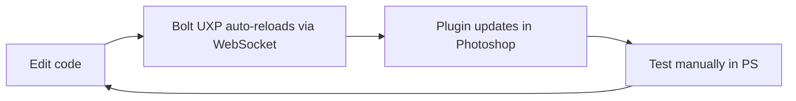

# Contributing

Thanks for your interest in contributing to Huechord.

## Prerequisites

| Tool                   | Version      | Install                                                 |
| ---------------------- | ------------ | ------------------------------------------------------- |
| **Node.js**            | 18+          | [nodejs.org](https://nodejs.org/)                       |
| **Yarn**               | 1.22+        | `npm i -g yarn`                                         |
| **Adobe Photoshop**    | 27.0+ (2026) | Creative Cloud Desktop                                  |
| **UXP Developer Tool** | 2.0+         | Creative Cloud Desktop > All Apps > UXP Developer Tools |

## First-Time Setup

```bash
# 1. Clone & install — both workspaces, or the build in step 5 fails
git clone <repo-url> && cd huechord
yarn install
(cd webview-ui && yarn install)

# 2. Install UXP Developer Tool (if not installed)
#    Creative Cloud Desktop > All Apps > search "UXP Developer Tools" > Install

# 3. Enable Photoshop developer mode
#    Photoshop > Preferences > Plugins > Enable Developer Mode

# 4. Enable UDT developer mode
#    Launch UDT > prompted on first run > click "Enable"
#    (requires admin privileges)

# 5. Build the plugin (required before first dev run)
yarn build

# 6. Load plugin in UDT
#    Open UDT > Add Plugin > select plugin/manifest.json
#    Click "Load" (NOT "Load and Watch" — Bolt UXP handles reloading)

# 7. Start dev server with hot reload
yarn dev
```

## Development Workflow



### Commands

| Command           | Description                                |
| ----------------- | ------------------------------------------ |
| `yarn dev`        | Start Vite dev server with hot reload      |
| `yarn build`      | Production build to `plugin/`              |
| `yarn package`    | Build + package as `.ccx` for distribution |
| `yarn zip`        | Bundle `.ccx` + assets into `.zip`         |
| `yarn test`       | Run unit tests (Vitest)                    |
| `yarn test:watch` | Tests in watch mode                        |
| `yarn lint`       | Lint with ESLint                           |
| `yarn typecheck`  | TypeScript type checking                   |

### Hot Reload Notes

- Bolt UXP uses its own WebSocket-based reload — do **not** use UDT's "Load and Watch"
- If you change `uxp.config.ts` or `manifest.json`, unload and re-load the plugin in UDT
- C++ hybrid changes (if any) require manual unload/rebuild/load cycle

## Project Layout

See [docs/project-structure.md](docs/project-structure.md) for full directory tree.

Key boundaries:

- **`src/algorithms/`** — Pure functions, no PS deps. Write tests here first.
- **`src/uxp/`** — Photoshop API integration. Cannot run in Node.js tests.
- **`src/webview/`** — Runs in browser context. No `require("photoshop")`.

## Making Changes

### Branch Naming

```
feat/short-description
fix/short-description
docs/short-description
refactor/short-description
```

### Commit Messages

Use [Conventional Commits](https://www.conventionalcommits.org/):

```
feat: add split-complementary harmony detection
fix: correct hue wrapping at 360 boundary
docs: update algorithm analysis with octree option
```

### Pull Request Process

1. Create a feature branch from `main`
2. Write/update tests for any algorithm changes
3. Ensure `yarn verify` passes — lint, format, typecheck, tests and the build.
   The pre-push hook runs it for you; CI runs the same set as separate steps.
   Nothing on GitHub blocks a merge on a red run, so this is the real gate
4. Keep PRs focused — one feature or fix per PR
5. Update relevant docs/ADRs if architecture changes

## CI

CI runs on a GitHub-hosted `ubuntu-latest` runner. `.github/workflows/ci.yml` runs the same five checks
as `yarn verify` — lint, format, typecheck, test, build — as separate steps, so a failure names itself
in the job list rather than hiding inside one aggregate command.

Nothing here needs macOS or Photoshop. Every check is plain Node, and the lockfiles carry each platform
variant of `esbuild`, so `--frozen-lockfile` resolves the Linux binary without touching `yarn.lock`.

### Hosted runs need the account to be in good standing

Standard runners are free on public repositories, but "free" is not the same as "unconditional". While
this repo was private, a hosted run ended before its first step with:

> The job was not started because [redacted]
> be increased.

[redacted]
[redacted]

[redacted]

Worth writing down, because the reasoning is the kind that gets rediscovered the hard way.

[redacted]
[redacted]
[redacted]
[redacted]
[redacted]. Not only through dependencies — `yarn lint`, `yarn typecheck` and
`yarn test` load `eslint.config.js`, `vitest.config.ts` and every test file _from the branch under
test_. The runner was not ephemeral either, and a second repository's runner shared the same account,
so the blast radius was wider than one repo.

That was documented as a knowingly accepted risk, and the acceptance rested on the repo being private
with a single collaborator. Making it public revokes exactly that: a fork's pull request turns into
[redacted]

Public repositories get standard hosted runners at no charge, so the reason to accept the risk
disappeared at the same moment the risk grew. The job now runs in a disposable VM, with a read-only
token, no repository secrets, and no fork guard to maintain — a contributor's pull request is checked
like anyone else's.

[redacted]
stops being read-only, or if a step in `yarn verify` is missing from CI. The point is that going back
has to be a decision someone writes down, not a line that slips in.

## Code Guidelines

- **Tests first** — AAA pattern (Arrange, Act, Assert). See [CLAUDE.md](CLAUDE.md).
- **BDD for domain logic** — Business logic in `src/algorithms/` (color extraction, harmony scoring) is specified with Gherkin `.feature` files run via `@amiceli/vitest-cucumber`, colocated as `<name>.feature` + `<name>.feature.test.ts` in `src/__tests__/`. Technical/infra code (debounce, dispose, bridge plumbing) uses plain AAA `describe`/`it` instead.
- **Pure algorithms** — Functions in `src/algorithms/` must have no side effects and no PS imports
- **Minimal modal scope** — `executeAsModal` blocks must be as short as possible
- **Dispose pixel data** — Always call `.dispose()` on `PhotoshopImageData` when done
- **Type everything** — No `any` types unless absolutely unavoidable
- **Coverage is gated on commit** — `pre-commit` runs `yarn test:coverage`, which fails below the thresholds in `vitest.config.ts`. Scope is `src/algorithms/`, `src/lib/` and `src/uxp/`; React entrypoints, WebView glue and type-only modules are excluded on purpose. When the real figure rises, raise the thresholds — never lower them to get a commit through.

## Debugging

### JavaScript (UXP Context)

1. In UDT, click **Debug** on your loaded plugin
2. Chrome DevTools-like debugger opens
3. Set breakpoints, inspect console

### WebView

1. WebView runs Edge (Windows) or Safari (macOS)
2. On macOS: Safari > Develop menu > find the WebView process
3. On Windows: `edge://inspect` to attach to WebView

### Common Issues

| Problem                | Fix                                                |
| ---------------------- | -------------------------------------------------- |
| Plugin won't load      | Check PS developer mode is enabled                 |
| UDT can't connect      | Restart UDT with admin privileges                  |
| Hot reload not working | Ensure `yarn dev` is running, check WebSocket port |
| `executeAsModal` error | Wrap PS API calls in `core.executeAsModal()`       |
| WebView blank          | Check manifest has `"webview": { "allow": "yes" }` |

## Architecture Decisions

Before proposing significant changes, check existing [ADRs](docs/adr/). If your change warrants a new architectural decision, create a new ADR following the template:

```markdown
# ADR-NNN: Title

**Status**: Proposed
**Date**: YYYY-MM-DD

## Context

## Options (with pros/cons)

## Decision

## Rationale

## Consequences
```

### Header fields

`Status` is one of:

| Value                   | Meaning                                      |
| ----------------------- | -------------------------------------------- |
| `Proposed`              | Under discussion, not yet binding            |
| `Accepted`              | Binding — the code is expected to match it   |
| `Rejected`              | Considered and declined; kept for the record |
| `Deprecated`            | No longer applies, with nothing replacing it |
| `Superseded by ADR-NNN` | A later decision replaced it                 |

Optional fields, all dated:

- **`Supersedes`** — on the replacing ADR, pointing back. May supersede a whole ADR or one named consequence of it.
- **`Superseded`** — on the replaced ADR, pointing forward. Say where, not what — the replacing ADR owns the content.

### Past ADRs are not edited

**An accepted ADR is a record of what was decided and when. Supersede it; do not amend it.** Write a new ADR that says what is true now and names what it replaces — a whole ADR, or a single consequence of one. `Status` is the only field that changes on an existing ADR, because a record has to be able to say it is no longer current.

This costs a reader one extra link and buys a history that can be trusted. An ADR edited after the fact answers "what do we think today" but can no longer answer "what did we believe when we wrote this code", which is the question you actually have when the code surprises you.

So an ADR may keep a stale number in its Consequences. That is not rot — it is the state of knowledge at its date, and a later ADR carries the correction.

The title should name everything the Decision decides, so the two can never drift apart, and so a later ADR can supersede exactly the part that changed.

## License

By contributing, you agree that your contributions will be licensed under the same license as the project.
