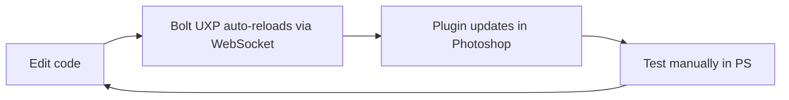

# Contributing

Thanks for your interest in contributing to Color Harmony Wheel.

## Prerequisites

| Tool                   | Version      | Install                                                 |
| ---------------------- | ------------ | ------------------------------------------------------- |
| **Node.js**            | 18+          | [nodejs.org](https://nodejs.org/)                       |
| **Yarn**               | 1.22+        | `npm i -g yarn`                                         |
| **Adobe Photoshop**    | 26.0+ (2025) | Creative Cloud Desktop                                  |
| **UXP Developer Tool** | 2.0+         | Creative Cloud Desktop > All Apps > UXP Developer Tools |

## First-Time Setup

```bash
# 1. Clone & install
git clone <repo-url> && cd colors
yarn install

# 2. Install UXP Developer Tool (if not installed)
#    Creative Cloud Desktop > All Apps > search "UXP Developer Tools" > Install

# 3. Enable Photoshop developer mode
#    Photoshop > Preferences > Plugins > Enable Developer Mode

# 4. Enable UDT developer mode
#    Launch UDT > prompted on first run > click "Enable"
#    (requires admin privileges)

# 5. Build the plugin (required before first dev run)
yarn build

# 6. Load plugin in UDT
#    Open UDT > Add Plugin > select plugin/manifest.json
#    Click "Load" (NOT "Load and Watch" — Bolt UXP handles reloading)

# 7. Start dev server with hot reload
yarn dev
```

## Development Workflow



### Commands

| Command           | Description                                |
| ----------------- | ------------------------------------------ |
| `yarn dev`        | Start Vite dev server with hot reload      |
| `yarn build`      | Production build to `plugin/`              |
| `yarn package`    | Build + package as `.ccx` for distribution |
| `yarn zip`        | Bundle `.ccx` + assets into `.zip`         |
| `yarn test`       | Run unit tests (Vitest)                    |
| `yarn test:watch` | Tests in watch mode                        |
| `yarn lint`       | Lint with ESLint                           |
| `yarn typecheck`  | TypeScript type checking                   |

### Hot Reload Notes

- Bolt UXP uses its own WebSocket-based reload — do **not** use UDT's "Load and Watch"
- If you change `uxp.config.ts` or `manifest.json`, unload and re-load the plugin in UDT
- C++ hybrid changes (if any) require manual unload/rebuild/load cycle

## Project Layout

See [docs/project-structure.md](docs/project-structure.md) for full directory tree.

Key boundaries:

- **`src/algorithms/`** — Pure functions, no PS deps. Write tests here first.
- **`src/uxp/`** — Photoshop API integration. Cannot run in Node.js tests.
- **`src/webview/`** — Runs in browser context. No `require("photoshop")`.

## Making Changes

### Branch Naming

```
feat/short-description
fix/short-description
docs/short-description
refactor/short-description
```

### Commit Messages

Use [Conventional Commits](https://www.conventionalcommits.org/):

```
feat: add split-complementary harmony detection
fix: correct hue wrapping at 360 boundary
docs: update algorithm analysis with octree option
```

### Pull Request Process

1. Create a feature branch from `main`
2. Write/update tests for any algorithm changes
3. Ensure `yarn test && yarn typecheck && yarn lint` pass
4. Keep PRs focused — one feature or fix per PR
5. Update relevant docs/ADRs if architecture changes

## Code Guidelines

- **Tests first** — AAA pattern (Arrange, Act, Assert). See [CLAUDE.md](CLAUDE.md).
- **Pure algorithms** — Functions in `src/algorithms/` must have no side effects and no PS imports
- **Minimal modal scope** — `executeAsModal` blocks must be as short as possible
- **Dispose pixel data** — Always call `.dispose()` on `PhotoshopImageData` when done
- **Type everything** — No `any` types unless absolutely unavoidable

## Debugging

### JavaScript (UXP Context)

1. In UDT, click **Debug** on your loaded plugin
2. Chrome DevTools-like debugger opens
3. Set breakpoints, inspect console

### WebView

1. WebView runs Edge (Windows) or Safari (macOS)
2. On macOS: Safari > Develop menu > find the WebView process
3. On Windows: `edge://inspect` to attach to WebView

### Common Issues

| Problem                | Fix                                                |
| ---------------------- | -------------------------------------------------- |
| Plugin won't load      | Check PS developer mode is enabled                 |
| UDT can't connect      | Restart UDT with admin privileges                  |
| Hot reload not working | Ensure `yarn dev` is running, check WebSocket port |
| `executeAsModal` error | Wrap PS API calls in `core.executeAsModal()`       |
| WebView blank          | Check manifest has `"webview": { "allow": "yes" }` |

## Architecture Decisions

Before proposing significant changes, check existing [ADRs](docs/adr/). If your change warrants a new architectural decision, create a new ADR following the template:

```markdown
# ADR-NNN: Title

**Status**: Proposed
**Date**: YYYY-MM-DD

## Context

## Options (with pros/cons)

## Decision

## Rationale

## Consequences
```

## License

By contributing, you agree that your contributions will be licensed under the same license as the project.
