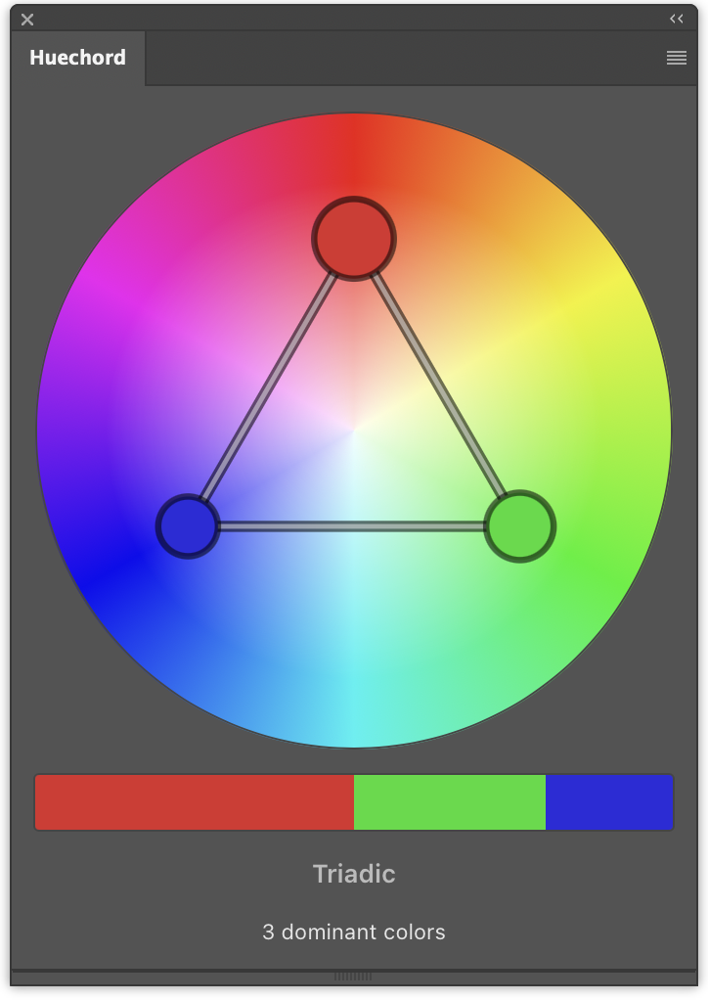

# Huechord

**A Photoshop panel that tells you, while you grade, whether the frame's colors form a harmony —
and which one.**

## The problem

Photoshop shows you the image. It does not show you the image's palette.

Color harmony — complementary, triadic, analogous — is a _relationship between hues_, and no panel in
Photoshop puts that relationship in front of you while you work. Checking it by hand means dropping
color samplers, reading RGB numbers off the Info panel, converting them to angles in your head, and
deciding whether three of them really sit 120 degrees apart. Then you pull one curve and every number
you just read is stale.

So in practice the check does not happen. You grade by eye, and whether the frame actually lands on a
harmony — or misses one by ten degrees, which is the interesting case — stays unanswered.

## What Huechord does

It keeps the wheel open beside the image and keeps it honest. It reads the colors the photograph is
actually made of, plots them by hue and saturation, and names the harmony they form. When the frame
is close to one but not on it, it says so and marks the color that is out of place — the one to move,
and which way.

No button, no re-sampling, no stale numbers. You grade; the panel keeps up.

## What it shows

**The wheel.** Every dominant color in the frame is a dot. Its angle is the hue, its distance from
the center is the saturation, its size is how much of the image that color covers. A glance tells
you what the picture is made of — not what the swatches in your adjustment layer say it should be.

**The bar.** The same colors as a weighted strip, in the proportions they occupy. This one keeps
the shadows and highlights the wheel ignores: it is a picture of the image, not of the theory.

**The name.** If the palette forms one of the classical harmonies, the panel names it —
complementary, split-complementary, triadic, tetradic, square, analogous, monochromatic. If it does
not, it says that instead. There is no score, because a percentage in the middle of the range reads
as a weak harmony when what it means is none.

**The near miss.** A frame one nudge away from a harmony is the one worth knowing about. The panel
says `Close to triadic`, draws the shape as a dashed outline, and rings the color that is furthest
from where it wants to be. That is the color to move — and it tells you which way without pretending
to a precision the measurement does not have.

**Your own sample points.** Place Photoshop's Color Sampler markers on the image and each one
appears on the wheel as a diamond, next to the colors the panel found on its own. Useful for the
question the dominant colors cannot answer: _where exactly does this skin tone sit?_ Sampled colors
never vote on the harmony — they are what you asked about, not what the image is made of.

## How it decides

A few rules, all of them deliberate:

- **Near-blacks and near-whites do not vote.** A shadow at `rgb(10,0,0)` is saturated and its hue is
  a rounding artifact; letting it close a triad would point you at nothing. They stay in the palette
  and in the bar, because they are genuinely in the picture.
- **A color needs a real share of the frame** before it counts toward a harmony. Otherwise a speck
  of accent color decides the answer for the whole image.
- **Ten degrees of tolerance.** Grading by eye does not land on the degree, and a harmony nobody can
  hit is not a harmony anybody can use.
- **The richest match wins.** A square contains two complementary pairs; reporting the pair would be
  describing a corner of what is there.

## Requirements

- Adobe Photoshop 27.0 or newer (2026)
- macOS or Windows

## Installing

Download the latest `.ccx` from [Releases](../../releases) and double-click it. Creative Cloud takes
it from there, and the panel appears under **Plugins → Huechord**.

Creative Cloud will say the plugin has not been verified by Adobe. That is what independent
distribution looks like — Huechord is published here rather than through Adobe Exchange, and UXP
plugins carry no signature to check.

Nothing to build, no Node and no Yarn. Those are only needed to work on the plugin, not to run it —
see [CONTRIBUTING.md](CONTRIBUTING.md).

## Status

MVP. The analysis pipeline, the wheel, the harmony detection, the near-miss reporting and the
sample points are all in and verified in Photoshop. Error reporting is the piece still missing.

## For developers

- [CONTRIBUTING.md](CONTRIBUTING.md) — setup, workflow, PR process
- [CLAUDE.md](CLAUDE.md) — architecture and conventions
- [docs/adr/](docs/adr/) — why things are the way they are
- [docs/](docs/) — design notes per feature

## License

Not yet chosen.
