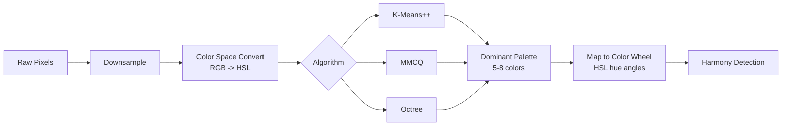

# Color Extraction Algorithms Analysis

Real-time dominant color extraction from Photoshop documents requires balancing accuracy with performance. This analysis evaluates algorithms suitable for running in a UXP plugin context on downsampled image data (~10k pixels).

## Color Harmony Types (Reference)

| Harmony | Colors | Angle on Wheel | Character |
|---------|--------|----------------|-----------|
| Complementary | 2 | 180° | High contrast |
| Analogous | 3 | ±30° | Calm, unified |
| Triadic | 3 | 120° | Vibrant, balanced |
| Split-complementary | 3 | 150°/210° | Contrast with less tension |
| Tetradic (rectangle) | 4 | Two complementary pairs | Rich, complex |
| Square | 4 | 90° | Even balance |
| Monochromatic | 1+ | 0° (varied S/L) | Elegant, simple |

## Extraction Algorithms

### K-Means Clustering
- **What**: Iteratively assigns pixels to K centroids, recalculates centroids until convergence
- **Pros**: Flexible K, well-understood, good results with K-Means++ init
- **Cons**: O(n*k*i) complexity, sensitive to initialization, non-deterministic
- **JS perf**: ~10k pixels, K=6 -> <50ms with K-Means++

### Modified Median Cut Quantization (MMCQ)
- **What**: Recursively splits color space at median points along longest axis, modified to better represent small clusters
- **Pros**: Fast, deterministic, purpose-built for color quantization, proven (used in Android Palette API)
- **Cons**: Less flexible than K-Means, fixed splitting strategy

### Median Cut (Original)
- **What**: Heckbert's 1982 algorithm, splits at true median
- **Pros**: Simple, fast
- **Cons**: Under-represents minority colors, superseded by MMCQ

### Octree Quantization
- **What**: Builds octree in RGB space, merges least-used nodes
- **Pros**: Good balance of speed/quality, deterministic
- **Cons**: Less common in JS ecosystem, fewer ready-made libraries

### Fuzzy C-Means
- **What**: Soft clustering where pixels have membership degrees across clusters
- **Pros**: Better for gradients and blended colors
- **Cons**: Slower than K-Means, overkill for palette extraction

## JavaScript Libraries

| Library | Algorithm | Size | Notes |
|---------|-----------|------|-------|
| **quantize** | MMCQ | ~3kB | Pure MMCQ, battle-tested, used by node-vibrant |
| **node-vibrant** | MMCQ + filters | ~15kB | WebWorker support, quality/downsampling param |
| **extract-colors** | Custom clustering | ~6kB | Zero deps, fast |
| **colorthief** | MMCQ (quantize) | ~5kB | Simple API, widely used |

## Harmony Detection Algorithm

Once dominant colors are extracted and converted to HSL:

1. Plot hue angles on [0°, 360°) circle
2. For each harmony type, compute ideal angle set from each dominant color as base
3. Score = sum of minimum angular distances between ideal and actual positions
4. Lowest score = closest harmony match
5. Display match percentage and highlight closest harmony

Angular distance formula: `min(|a - b|, 360 - |a - b|)`

## Conclusion

MMCQ via `quantize` library is the best fit: fast, deterministic, small, proven. K-Means++ is a viable alternative if more control over cluster count is needed. On ~10k downsampled pixels, both run in <50ms. See [ADR-003](adr/003-color-extraction-algorithm.md).
