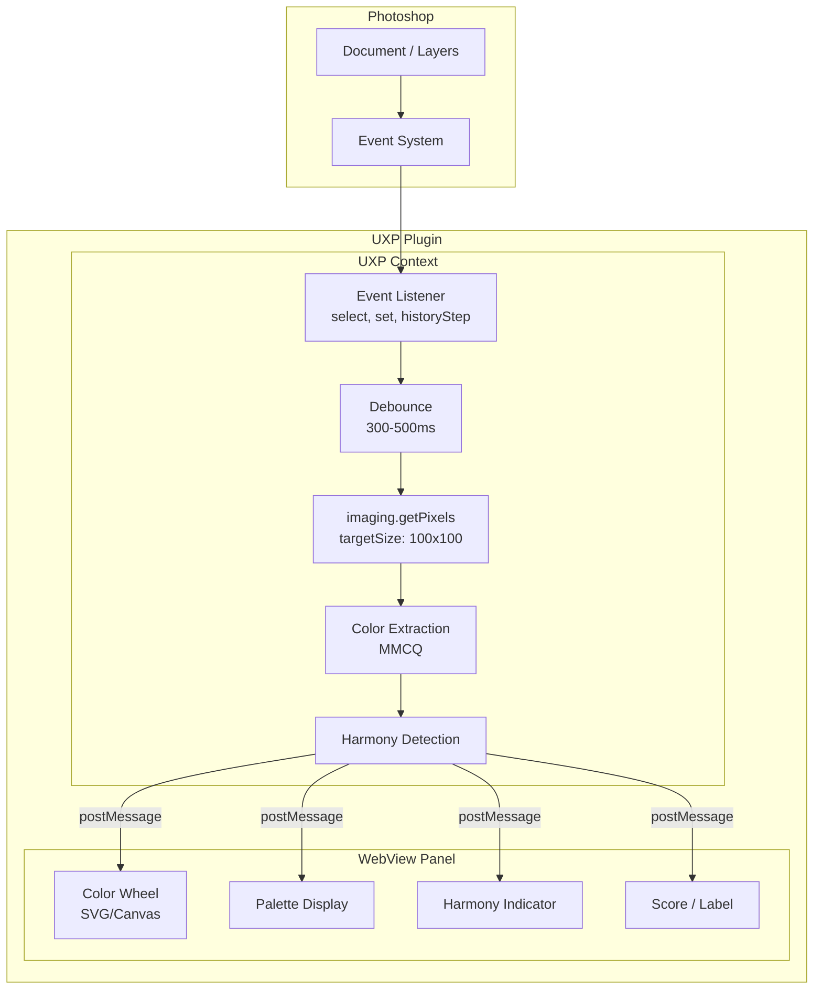
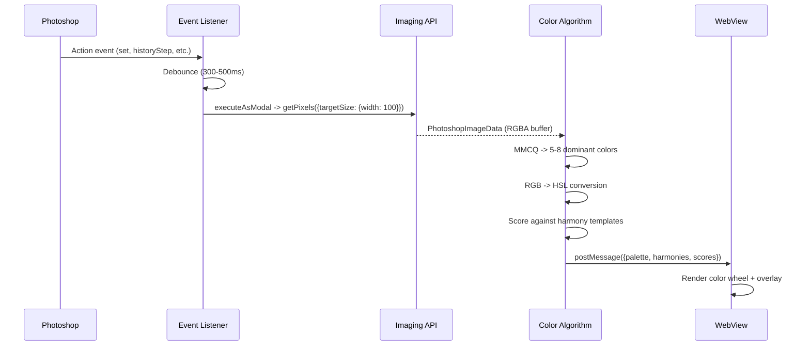
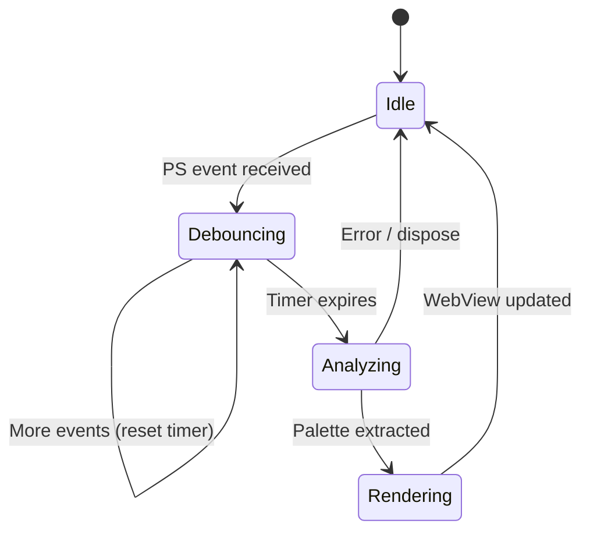

# Implementation Approach Analysis

A Photoshop UXP plugin that displays dominant colors on a color wheel in real-time during retouching/grading, showing proximity to color harmonies. This document covers architecture, data flow, and performance strategy.

## Architecture

## Data Flow

## Event Handling Strategy

### Events to Listen

| Event | Trigger |
|-------|---------|
| `set` | Property changes (curves, levels, hue/sat adjustments) |
| `historyStepBackward` / `historyStepForward` | Undo/redo |
| `select` | Layer or document switch |
| `make` | New layer/adjustment created |
| `delete` | Layer deleted |
| `play` | Action played |

### Debouncing

Heavy edits (brush strokes, slider dragging) generate many events. Debounce with 300-500ms delay. Additionally, skip re-analysis if `getPixels` is already in progress (mutex flag).

## Performance Budget

| Step | Target | Strategy |
|------|--------|----------|
| Event -> debounce | <500ms | Debounce timer |
| `getPixels` | <100ms | `targetSize: {width: 100}` (~10k pixels) |
| MMCQ extraction | <50ms | Small input, pure JS |
| Harmony scoring | <5ms | Simple angle math |
| WebView render | <16ms | SVG/Canvas update, no full re-render |
| **Total** | **<700ms** | Near real-time feedback |

## Key Technical Decisions

### Why composite, not individual layers
- Color grading affects the final look, not individual layers
- `getPixels()` without `layerID` returns the document composite
- Single API call instead of merging multiple layers

### Why WebView over native Canvas
- Color wheel requires radial gradients, arc paths, smooth animations
- UXP native 2D Canvas is limited to basic shapes
- UXP native SVG renderer is buggy for complex graphics
- WebView gives full Edge/Safari rendering engine
- See [ADR-002](adr/002-webview-for-ui.md)

### Color space handling
- `getPixels` returns data in document color space (usually sRGB)
- Convert to HSL for wheel positioning: `H` = angle, `S` = distance from center, `L` = brightness
- Harmony detection operates purely on Hue angles
- Consider weighting by saturation (desaturated colors are less relevant to harmony)

## Risk Mitigation

| Risk | Impact | Mitigation |
|------|--------|------------|
| `executeAsModal` blocks PS UI | User feels lag | Keep modal scope minimal, small targetSize |
| WebView startup overhead | Slow panel open | Lazy-init WebView, show loading state |
| Events not firing for all edits | Missed updates | Use broad event set + periodic polling fallback (5s) |
| Color space mismatch | Wrong colors on wheel | Read document profile, convert consistently |
| Large documents slow `getPixels` | Lag on 100MP images | `targetSize` makes this independent of doc size |

## Conclusion

The approach is feasible with predictable <700ms update cycle. The main architectural split is UXP context (data acquisition + algorithms) communicating via `postMessage` to WebView (rendering). See [ADR-001](adr/001-uxp-over-cep.md), [ADR-002](adr/002-webview-for-ui.md), [ADR-003](adr/003-color-extraction-algorithm.md), [ADR-004](adr/004-build-tooling.md), [ADR-005](adr/005-manifest-and-api-version.md).
