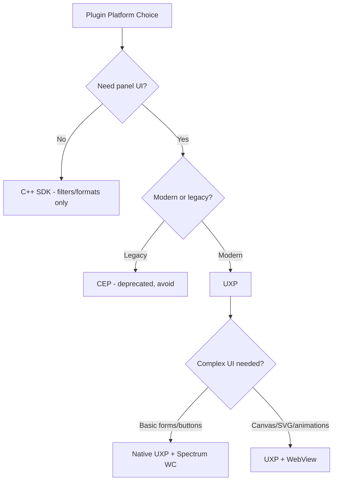

# UXP Plugin Technology Analysis

Photoshop plugin development has multiple extensibility frameworks. This analysis evaluates which platform to use for a real-time color harmony panel plugin (2025/2026 standard).

## Platform Options

### UXP (Unified Extensibility Platform)

- **What**: Adobe's current standard for CC plugin development. JS/HTML/CSS-based.
- **Pros**: Actively developed, manifest v5, Imaging API, hybrid C++ support, Spectrum Web Components, WebView support
- **Cons**: Not a full browser (limited HTML/CSS subset), 2D Canvas basic only, SVG rendering limited to simple icons
- **Min version**: PS 23.3.0+ (manifest v5), PS 26+ for UXP v8.0 features

### CEP (Common Extensibility Platform)

- **What**: Legacy Chromium-based panel framework
- **Pros**: Full browser environment, mature ecosystem
- **Cons**: **Deprecated**. CEP 12 is final version. No new features. Security patches only.

### ExtendScript

- **What**: ECMA Script 3 scripting engine
- **Pros**: Deep PS DOM access
- **Cons**: **Deprecated**. No pixel access API. Ancient JS (ES3). No UI panels.

### C++ SDK (Standalone)

- **What**: Native Photoshop SDK for filters, file formats, selections
- **Pros**: Maximum performance, full PS API access
- **Cons**: No panel UI, complex build, platform-specific. Only for filters/formats.

## Manifest Versions

| Version | UXP  | Min PS  | Key Features                                       |
| ------- | ---- | ------- | -------------------------------------------------- |
| v4      | <6.0 | 22.x    | Basic plugins                                      |
| **v5**  | 6.0+ | 23.3.0+ | Permissions model, WebView, hybrid C++, multi-host |

There is no manifest v6. New features are gated via **feature flags** (e.g., `enableSWCSupport`, `CSSNextSupport`).

## API Versions

| apiVersion | Status         | Notes                                                                |
| ---------- | -------------- | -------------------------------------------------------------------- |
| 1          | **Deprecated** | Will be removed in future PS release                                 |
| **2**      | Current        | Requires `executeAsModal` for state changes. New features only here. |

## UI Rendering Options

### Native UXP Panel

- Spectrum Web Components for standard controls
- 2D Canvas API (basic shapes only, since UXP v7.0)
- SVG: limited to simple icons, complex SVGs render incorrectly
- No WebGL

### WebView Panel (manifest v5 or later)

- Full browser engine (Edge on Windows, Safari on macOS)
- Full HTML5 Canvas, SVG, CSS animations, WebGL
- Communication with UXP context via `postMessage()` / Comlink
- Requires `requiredPermissions.webview` in manifest
- Local HTML files supported since UXP v8.0

## Build Tooling

| Tool                  | Type                         | Notes                                    |
| --------------------- | ---------------------------- | ---------------------------------------- |
| **Bolt UXP**          | Vite + React/Svelte/Vue + TS | Community, modern, MIT license           |
| Adobe React Starter   | Webpack 4                    | Official but outdated deps, known issues |
| SWC UXP React Starter | Webpack + SWC                | Official, Spectrum Web Components        |
| Custom Webpack        | Webpack 5                    | DIY setup                                |

## Distribution

- Package format: `.ccx` (zip-based), created via UXP Developer Tool
- Channels: Adobe CC Marketplace or direct distribution
- Marketplace limit: 50MB bundle, must support Mac M1 + Intel + Windows Intel
- macOS: requires signing and notarization with valid certificate

## Conclusion

UXP with apiVersion 2 and WebView for complex UI is the only viable modern approach. CEP and ExtendScript are dead ends. The project ships manifest v6 — see [ADR-001](adr/001-uxp-over-cep.md), [ADR-002](adr/002-webview-for-ui.md), [ADR-006](adr/006-manifest-v6.md).
