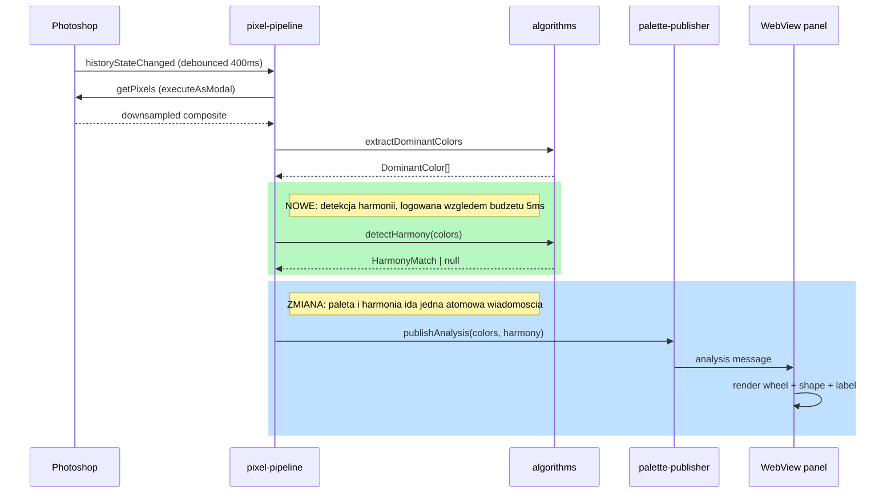

# Design — Harmony Detection & Overlay (Step 4)

## TL;DR

- 🎯 The panel stops at "here are your colors" today. This adds the judgement the plugin exists to make: **does this frame show a color harmony, and which colors form it.**
- ✅ ❌ The answer is yes or no, not a percentage — **ADR-008** records why. A number in the middle of the range reads as a weak match when it means no match.
- 📐 When the answer is yes, the panel draws lines **through the dots that form the shape**: a segment for complementary, a triangle for a triad, a rectangle for a square. The dots themselves are drawn either way.
- 🧩 Ships as **three PRs** — the decision, the algorithm, the panel — because one would land well over the repo's size convention.

## Scope split into PRs

Every acceptance criterion below names the PR that delivers it.

| PR                                                       | Content                                                                                                                                                   |
| -------------------------------------------------------- | --------------------------------------------------------------------------------------------------------------------------------------------------------- |
| **PR 1** — `docs/harmony-scoring-decision` (base `main`) | ADR-008 and this document                                                                                                                                 |
| **PR 2** — `feat/harmony-detection` (base: PR 1)         | `src/algorithms/harmony.ts`, `harmony.feature` + step tests                                                                                               |
| **PR 3** — `feat/harmony-overlay` (base: PR 2)           | Bridge contract extension (palette + harmony in one message), pipeline wiring + timing log, `HarmonyOverlay`, `HarmonyLabel`, panel styles, WebView tests |

PR 1 is the decision on its own terms, arguable without reading a diff of the thing it decided. PR 2 is mergeable and useful by itself — detected harmonies reach the UDT console. PR 3 is what puts them on screen. PR 1 targets `main` and is opened as a draft, so merging it early cannot orphan the rest of the stack.

## Responsibilities (SRP / bounded context)

| Module                                          | Owns                                                                                                        | Explicitly does not own                |
| ----------------------------------------------- | ----------------------------------------------------------------------------------------------------------- | -------------------------------------- |
| `src/algorithms/harmony.ts`                     | Templates, eligibility, angular distance, the match. Pure, no PS/DOM/React.                                 | Rendering, message shapes, timing logs |
| `src/algorithms/types.ts`                       | `HarmonyType`, `HarmonyMatch`                                                                               | —                                      |
| `src/bridge/messages.ts`                        | The wire contract: one `analysis` message carrying palette **and** harmony                                  | How either was computed                |
| `src/uxp/pixel-pipeline.ts`                     | Calling extraction, then detection, then publishing once; logging detection duration against the 5ms budget | The rules                              |
| `webview-ui/src/wheel-geometry.ts`              | Where a dot sits on the wheel — reused unchanged to place the shape's vertices                              | Colors, markup                         |
| `webview-ui/src/components/harmony-overlay.tsx` | Drawing the shape through the dots the match names                                                          | Deciding which harmony                 |
| `webview-ui/src/components/harmony-label.tsx`   | The harmony's name, or that there is none                                                                   | Formatting rules for anything else     |

The algorithm layer stays free of the transport layer, the same boundary Steps 2 and 3 established.

## Optional prerequisite refactoring

`webview-ui/src/palette-store.ts` stores exactly `DominantColor[]` and needs to hold `{colors, harmony}`. That is a ~10-line widening, not a refactor — **no prerequisite refactoring is proposed**. Deliberately rejected: a generic "analysis store" abstraction, which would be an abstraction for a single use (KISS).

## The rules

```
angDist(a, b) = min(|a - b|, 360 - |a - b|)

eligible = colors with saturation ≥ 10% and share of image ≥ 5%
arc      = the narrowest arc holding every eligible color
           (found from the widest empty gap on the wheel)

arc ≤ 20°                    -> monochromatic
arc ≤ 60°                    -> analogous
otherwise, over every template whose arm count equals the number of eligible
colors, and over every placement of it on the wheel:
  every arm on a distinct eligible color within ±10°  -> the tightest such fit
else                                                  -> none
```

Harmonies split in two. **Monochromatic and analogous are arcs** — neighbourhoods of hue, decided by how wide a span the palette occupies, so a run of four hues 20° apart counts as much as three at 30°. **The rest are shapes** — templates of offsets that may sit anywhere on the wheel: square, tetradic, triadic, split-complementary, complementary. Only those with exactly as many arms as the palette has colors are tried, and the tightest fit wins.

The constants and their justification are in [ADR-008](adr/008-harmony-detection.md). The one worth arguing with is **"as many eligible colors as the template has arms, no more"** — it is what stops six scattered hues from reliably containing a near split-complementary triple, and what stops the panel drawing a shape that leaves a dominant dot untouched. It is also what makes the reading strict.

### Decision table

Each row is a scenario in `src/__tests__/harmony.feature`. Weights equal and saturation 80% unless stated.

| Input hues                                | Result                                                                |
| ----------------------------------------- | --------------------------------------------------------------------- |
| 0°, 180°                                  | complementary, colors 0 and 1                                         |
| 0°, 172°                                  | complementary — 8° off is inside the tolerance                        |
| 0°, 165°                                  | **none** — 15° off is not                                             |
| 0°, 120°, 240°                            | triadic, 3 colors                                                     |
| 0°, 150°, 210°                            | split-complementary                                                   |
| 30°, 58°, 88°                             | analogous                                                             |
| 0°, 90°, 180°, 270°                       | square, 4 colors — not the complementary pair inside it               |
| 0°, 60°, 180°, 240°                       | tetradic                                                              |
| 0°, 120°, 240°, 55°                       | **none** — the fourth color sits on no arm                            |
| 359°, 1°                                  | monochromatic — **not** treated as 358° apart                         |
| 0° (w .48), 180° (w .48), 90° (w .04)     | complementary, 2 colors — the trace color neither joins nor breaks it |
| 0°, 180° saturated + 90° at 3% saturation | complementary — a gray carries no hue to place                        |
| 0°, 120°, 240° all at 4% saturation       | **none**                                                              |
| a single color                            | monochromatic                                                         |
| 12°, 88°, 133°, 196°, 271°, 338°          | **none**                                                              |
| empty palette                             | **none** (`null`)                                                     |

## Message flow



Sending them separately would let the shape be drawn through dot positions from the previous frame. One message removes the possibility rather than making it unlikely — and here it would be visible, since the shape's vertices _are_ the dots.

## Data structure

No persistence and no schema in this plugin — nothing to draw an ERD for. The wire contract does change shape, which is why `BRIDGE_VERSION` goes to 2: an older WebView receiving a v2 message rejects it through the existing `version > BRIDGE_VERSION` guard rather than rendering half of it.

`HarmonyMatch` carries **positions in the palette**, not colors or angles. The panel already has the colors and has already placed them; giving it indices is what guarantees the shape's vertices are the dots the user is looking at, rather than a second opinion about where they are.

## Performance

- Work per analysis: the arc costs one sort plus one pass. Only templates whose arm count equals the eligible count are tried at all, so at most two of them (square and tetradic, at four colors each); within one, every eligible color plays base and every arm scans the pool — `eligible² × arms`, so under 150 angular comparisons in the worst case, each a subtract/abs/min. Comfortably inside the 5ms budget, but timed and logged per the DoD, with a clock that can resolve sub-millisecond work.
- No I/O and no allocation beyond a few small arrays; it runs on the existing debounced path and adds nothing to the event rate.
- Blast radius: a throw in detection would kill the analysis pass. It runs inside the pipeline's existing `catch`, and the function has no throwing branch — an empty palette returns `null`.

## Security

The input is colors already derived from the user's image; nothing new leaves the process. The existing rule holds: rejected bridge messages log their **shape**, never their contents. The validator checks the harmony with the same discipline as the palette — a known type name, and indices that are whole numbers inside the palette it arrived with, since an out-of-range index would be read straight into a `cx` attribute.

## ADR compliance

- **ADR-002 (WebView for UI)** — shape and label are WebView components; nothing new is drawn in the UXP context. ✅
- **ADR-003 (MMCQ)** — untouched; detection consumes the extractor's output. ✅
- **ADR-007 (Photoshop floor)** — no new host API. ✅
- **New: ADR-008** — detection instead of scoring, and the three constants, because the panel's answer is user-visible behavior, not an implementation detail.

## UI

The change is user-facing by definition. Dominant colors keep being drawn on the wheel exactly as they are now. When a harmony is detected, lines connect the dots that form it — closed for three or more, a single segment for two, nothing for monochromatic, which is a cluster rather than a relationship — and a label names it. When none is detected there are no lines and the label says so.

It reuses the existing panel conventions: host color scheme via CSS variables, the wheel's own `viewBox` space, `role="img"` plus `aria-label` on graphical output as `ColorWheel` and `PaletteBar` already do.

## Repo conventions

- Algorithms in `src/algorithms/` stay pure and are BDD-specced as `harmony.feature` + `harmony.feature.test.ts` (CLAUDE.md). Bridge and pipeline plumbing stay plain AAA.
- All logging through `src/lib/logger.ts`.
- No feature flags, audit log or error-tracking policy exists in this repo — nothing to address.

## Interfaces

- **Code**: `detectHarmony(colors)` exported from `src/algorithms/harmony.ts`, plus the three constants it is governed by.
- **UI**: harmony name and the shape on the wheel in the Photoshop panel.
- **CLI**: none. The plugin has no CLI surface and this change does not add one.

## Gherkin

The full spec is [`src/__tests__/harmony.feature`](../src/__tests__/harmony.feature) — one scenario per row of the decision table. The happy path and the rule that carries the decision:

```gherkin
Scenario: Triadic harmony detected
  Given dominant colors at hues 0, 120 and 240
  When harmony detection runs
  Then the harmony is triadic
  And it is formed by 3 colors

Scenario: A color off the shape makes the answer no
  Given dominant colors at hues 0, 120, 240 and 55
  When harmony detection runs
  Then no harmony is reported
```

## Acceptance criteria

Checked once the PR named against the item has it implemented and tested.

- [x] **PR 1** — ADR-008 records the yes/no decision, the three constants and their justification
- [x] **PR 2** — `src/algorithms/harmony.ts` exports `detectHarmony`, pure, no PS/DOM imports
- [x] **PR 2** — angular distance is exactly `min(|a−b|, 360−|a−b|)`; 359°/1° behaves as 2° apart
- [x] **PR 2** — a color within ±10° of an ideal position counts; past it, it does not, with the template free to sit anywhere on the wheel
- [x] **PR 2** — of the templates the palette is the right size for, the tightest fit is the one reported
- [x] **PR 2** — colors under 5% of the image or under 10% saturation take no part, in either direction
- [x] **PR 2** — as many eligible colors as the template has arms, no more, or the answer is no
- [x] **PR 2** — monochromatic and analogous are decided from the arc the palette occupies, at any color count and any spacing
- [x] **PR 2** — geometric templates: complementary, split-complementary, triadic, tetradic, square
- [x] **PR 2** — the answer does not depend on the order the extractor emits colors in
- [x] **PR 2** — the match names which colors form the harmony, in the order the shape connects them
- [x] **PR 2** — scattered hues report no harmony
- [x] **PR 2** — `harmony.feature` covers every row of the decision table
- [x] **PR 3** — palette and harmony arrive in one bridge message, `BRIDGE_VERSION` bumped to 2
- [x] **PR 3** — dominant colors are drawn on the wheel whether or not a harmony was found
- [x] **PR 3** — a detected harmony draws lines through the dots that form it, and is named
- [x] **PR 3** — no harmony draws no lines and says so
- [x] **PR 3** — detection duration is logged, and a breach of the 5ms budget is logged as such
- [x] **all three** — `yarn test`, `yarn lint`, `yarn typecheck`, `yarn build` pass
