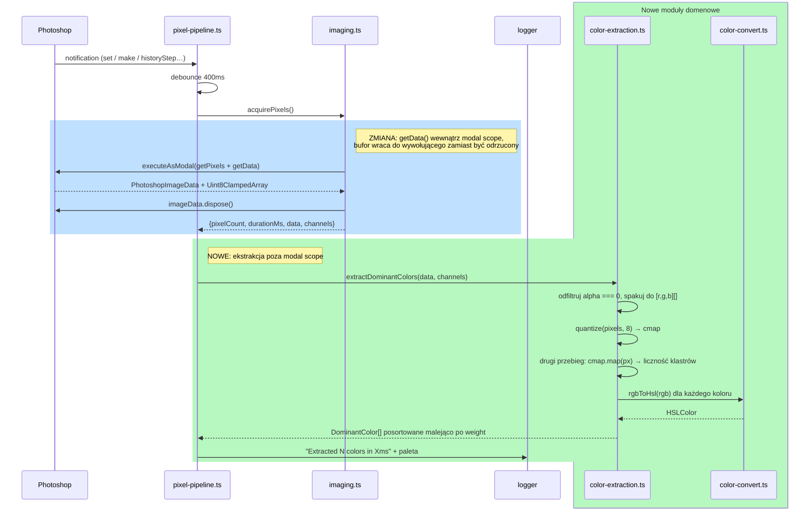

# Design — Step 2: Color Extraction

Design document for [issue #4](https://github.com/matee911/colors/issues/4). Covers `src/algorithms/color-convert.ts`,
`src/algorithms/color-extraction.ts` and the wiring that turns the Step 1 pixel pipeline into a palette pipeline.

## TL;DR

- **What**: two pure modules in `src/algorithms/` — RGB↔HSL conversion and MMCQ-based dominant color extraction —
  plus the pipeline wiring that logs the extracted palette after every edit in Photoshop.
- **How**: MMCQ via the `quantize` library (per [ADR-003](adr/003-color-extraction-algorithm.md)). Weights are
  computed by this repo, not by the library — `quantize`'s public API exposes no per-cluster population.
- **Consequence**: `acquirePixels()` stops discarding the buffer it fetches and starts returning it, so extraction
  can run outside the modal scope. That is the only change to Step 1 code.
- **Value**: the plugin gets its first real domain output. Everything downstream (Step 3 wheel, Step 4 harmony
  scoring) consumes `DominantColor[]`, so this is the last step before anything is visible on screen.
- **Split**: delivered as **two stacked PRs** (conversion first, extraction + wiring second) to stay under the
  500-line review limit.

## Scope boundary

Explicitly **out of scope** for this step, per the tech lead review on issue #4 and `docs/implementation-plan.md`:

- near-black / near-white filtering — deliberately placed in Step 5; `color-extraction.ts` stays filter-free here
- any UI: no wheel, no swatches, no WebView message. Output goes to the UDT console only (Step 3 owns the UI)
- picking a different algorithm — ADR-003 settled on MMCQ; this document does not re-litigate it

## Responsibility split (DRY / SRP / Bounded Context)

| Module                                         | Responsibility                                                               | Knows about                                |
| ---------------------------------------------- | ---------------------------------------------------------------------------- | ------------------------------------------ |
| `src/algorithms/types.ts`                      | Shared color vocabulary (`RGBColor`, `HSLColor`, `DominantColor`, `Palette`) | nothing (exists already, unchanged)        |
| `src/algorithms/color-convert.ts` **(new)**    | Color _space_ math only: `rgbToHsl`, `hslToRgb`                              | `types.ts`                                 |
| `src/algorithms/color-extraction.ts` **(new)** | Reducing a pixel buffer to weighted dominant colors                          | `types.ts`, `color-convert.ts`, `quantize` |
| `src/uxp/imaging.ts` **(modified)**            | Photoshop pixel acquisition — now also hands back the buffer                 | Photoshop API                              |
| `src/uxp/pixel-pipeline.ts` **(modified)**     | Orchestration: event → debounce → acquire → extract → log                    | both sides                                 |

The boundary that matters: **`src/algorithms/` never imports from `src/uxp/`**. Extraction takes a plain byte array
plus a channel count, not a `PhotoshopImageData`. That keeps the whole domain testable in Node,
which is the point of CLAUDE.md's "keep algorithms pure and side-effect free".

`color-convert` is a separate module from `color-extraction` rather than a private helper because Step 3 (wheel
positioning) and Step 4 (harmony scoring) both need conversion without needing extraction — folding it in would
guarantee a later split.

### Suggested optional prerequisite refactor

**None required.** One thing was considered and rejected: extracting a `PixelBuffer` value object to wrap
`{data, channels}`. With exactly one producer and one consumer it would be an abstraction for single-use code,
which CLAUDE.md's KISS rule argues against. Revisit if Step 5 adds a second buffer source.

## Data structures

No persisted schema, no database, no migration — this repo has none. The only shape that changes is an in-memory
return type, so an ERD would have nothing to say:

```ts
// src/uxp/imaging.ts — before
interface PixelAcquisitionResult {
  pixelCount: number;
  durationMs: number;
}

// after: the buffer the modal scope already fetched is no longer thrown away
interface PixelAcquisitionResult {
  pixelCount: number;
  durationMs: number;
  data: Uint8Array; // was: absent → is: RGBA/RGB interleaved samples
  channels: number; // was: absent → is: 3 or 4, from imageData.components
}
```

`DominantColor` and `Palette` in `src/algorithms/types.ts` are used as-is. They were written in Step 0 for exactly
this purpose and need no change.

## Flow



Event Storming is not used here on purpose: this step adds no business process, no actor decision and no domain
policy — it is one more technical stage inside an existing pipeline. The sequence diagram above carries the whole
change.

## Key design decisions

### 1. Weights are computed here, not read from `quantize`

`quantize`'s public surface is `cmap.palette()`, `cmap.map(color)` and `cmap.size()`. Cluster population lives on
`cmap.vboxes[i].vbox.count()` — an undocumented internal of an unmaintained 2013 library. So: run MMCQ to get the
palette, then walk the pixels a second time and attribute each one to `cmap.map(pixel)`. Cost is one extra O(n) pass
over ~10k pixels, which is noise next to the quantization itself, and it makes the 50/50 weight in the acceptance
criteria exactly true rather than approximately true.

### 2. `quantize` in the UXP runtime

The tech lead flagged this as a possible blocker. Static answer: `quantize@1.0.2` is 490 lines, zero dependencies,
and references no `Buffer`, `process`, `require`, `window` or `global` — its only host coupling is
`module.exports`, which Vite resolves at build time. Runtime answer: verified by loading the built plugin in
Photoshop (see "How to test manually" in the PR).

`quantize` returns `false` — not an empty palette — when `pixels.length === 0` or `maxColors < 2`. That is a real
branch, not defensive coding for an impossible state: a fully transparent selection filters down to zero pixels.
Handled by returning `[]`.

### 3. Reported colors are cluster averages, not source pixels

MMCQ bins colors at 5 bits per channel and reports each cluster's average, so a buffer of pure `(255, 0, 0)` comes
back as roughly `(252, 4, 4)`. That is the algorithm working as designed, not a rounding bug — the palette answers
"what color is this region", not "which exact pixel value appears most often". Tests assert hue and weight exactly
and channel values within tolerance, so nobody later "fixes" the artifact by pinning it down.

### 4. Fully transparent pixels are dropped before quantization

RGB under a fully transparent pixel is undefined garbage in a composite. Feeding it to MMCQ pulls phantom colors
into the palette. Pixels with `alpha === 0` are skipped. Partial transparency is kept as-is — a 50%-opacity red
brush stroke is genuinely part of what the retoucher sees, and the composite has already blended it.

### 5. Achromatic hue is 0, by definition

For `S === 0` (black, white, any gray) hue is mathematically undefined. Left implicit it becomes `NaN` and poisons
Step 4's harmony scoring silently. `rgbToHsl` returns `h: 0` and the tests assert that value explicitly.

### Decision table — `rgbToHsl`

| Input RGB         | Expected HSL     | Why it's in the table                               |
| ----------------- | ---------------- | --------------------------------------------------- |
| `(255, 0, 0)`     | `(0, 100, 50)`   | red anchors 0°                                      |
| `(0, 255, 0)`     | `(120, 100, 50)` | green anchors 120°                                  |
| `(0, 0, 255)`     | `(240, 100, 50)` | blue anchors 240°                                   |
| `(255, 255, 255)` | `(0, 0, 100)`    | white — achromatic, H pinned to 0                   |
| `(0, 0, 0)`       | `(0, 0, 0)`      | black — achromatic, H pinned to 0                   |
| `(128, 128, 128)` | `(0, 0, 50.2)`   | mid gray — achromatic, H pinned to 0                |
| `(255, 255, 0)`   | `(60, 100, 50)`  | secondary, catches a wrong max-channel branch       |
| `(0, 255, 255)`   | `(180, 100, 50)` | secondary, catches sign errors around the 180° wrap |

## Performance review

- **Budget**: <50 ms for extraction on ~10 000 pixels (`targetSize: {width: 100}` output), asserted in the test suite.
- **Cost model**: pack+filter O(n) → MMCQ ~10-20 ms per ADR-003 → attribution pass O(n·k) with k ≤ 8. Dominated by
  MMCQ; the two linear passes are a few hundred microseconds at this size.
- **Blast radius**: bounded by `targetSize`, which is fixed at width 100. A 40-megapixel document costs the same as
  a 2-megapixel one, because the downsample happens in Photoshop before the buffer reaches us.
- **Repeat cost**: the 400 ms debounce from Step 1 already caps invocation rate, so a slider drag produces one
  extraction, not sixty. No caching is added — recomputation is cheaper than any cache invalidation strategy tied
  to document state.
- **Not applicable**: N+1 queries, indexes, cache tiers — there is no data store in this plugin.

## Security review

Minimal surface, but two things worth stating rather than assuming:

- **New dependency**: `quantize@1.0.2` — zero transitive dependencies, MIT, ~9 kB unpacked. Zero deps is the reason
  an unmaintained package is acceptable here: there is no transitive supply chain to rot underneath it, and the
  vendored code is short enough to read end to end (it was, for this document).
- **Data handling**: pixel data stays in memory inside the plugin, is never serialized, persisted or sent anywhere.
  This step adds no network calls and no filesystem writes.
- **Untrusted input**: the buffer comes from Photoshop, not from a user-supplied file parsed by us. The one hostile
  shape worth handling is a degenerate/empty buffer, covered above.

## ADR compliance

| ADR                                                                               | Status for this change                                                                                                                                                                  |
| --------------------------------------------------------------------------------- | --------------------------------------------------------------------------------------------------------------------------------------------------------------------------------------- |
| [003 — MMCQ for dominant color extraction](adr/003-color-extraction-algorithm.md) | **Followed.** MMCQ via `quantize`, up to 8 colors. ADR's "may return fewer than N" consequence is reflected in the tests, which never assert an exact count of 5-8 for arbitrary input. |
| [002 — WebView for UI](adr/002-webview-for-ui.md)                                 | Unaffected — no UI in this step.                                                                                                                                                        |
| [007 — Photoshop floor 27.0](adr/007-photoshop-floor.md)                          | Unaffected — no new host API is used beyond `imageData.getData()`, present well below the floor.                                                                                        |

No new ADR is needed: this implements an accepted decision rather than making one.

## Interfaces

- **Code**: `extractDominantColors(data, channels, maxColors?)` and `rgbToHsl` / `hslToRgb`, exported from
  `src/algorithms/`. This is the interface Step 3 and Step 4 will consume.
- **UI**: **none, deliberately.** The Definition of Done asks for console output, and `docs/implementation-plan.md`
  assigns every pixel of UI to Step 3. Shipping a half-wheel here would be scope creep and would have to be
  rewritten next step.
- **CLI**: none. This is a Photoshop panel; the repo has no CLI surface.
- **Observability**: via the `logger` abstraction (`src/lib/logger.ts`), as CLAUDE.md requires — never raw
  `console.*`. Palette and timing are logged at `info`, extraction failures at `error`.

## Repo conventions applied

From `CLAUDE.md`: domain logic under `src/algorithms/` gets **BDD tests** (Gherkin `.feature` +
`@amiceli/vitest-cucumber`, colocated in `src/__tests__/`); infra changes stay plain AAA. `logger` for all output.
Pure, side-effect-free algorithms. Tests before code. The repo defines no feature flags, audit log or error tracking
to hook into at this stage.

## Spec (Gherkin)

Summarised below. The executable version lives in `src/__tests__/color-convert.feature` and
`src/__tests__/color-extraction.feature`, where the known-value cases are expanded into `Scenario Outline`
examples tables.

```gherkin
Feature: RGB and HSL conversion

  Scenario: Convert a primary color to HSL
    Given the RGB color 255, 0, 0
    When it is converted to HSL
    Then the result is hue 0, saturation 100, lightness 50

  Scenario: Achromatic colors get a defined hue
    Given the RGB color 128, 128, 128
    When it is converted to HSL
    Then the hue is 0
    And the saturation is 0

  Scenario: Round-trip conversion preserves the color
    Given the RGB color 37, 150, 190
    When it is converted to HSL and back to RGB
    Then the result matches the original within rounding tolerance

Feature: Dominant color extraction

  Scenario: Single-color image
    Given a pixel buffer where every pixel is 200, 30, 60
    When dominant colors are extracted
    Then exactly 1 dominant color is returned
    And its weight is approximately 1.0

  Scenario: Two-color split image
    Given a pixel buffer split evenly between 255, 0, 0 and 0, 0, 255
    When dominant colors are extracted
    Then 2 dominant colors are returned
    And each weight is approximately 0.5

  Scenario: Real-world-like image
    Given a pixel buffer of 10000 pixels with over 100 distinct colors
    When dominant colors are extracted
    Then between 5 and 8 dominant colors are returned
    And they are sorted by descending weight
    And every color has rgb, hsl and weight
    And extraction completes in under 50 milliseconds

  Scenario: Fully transparent pixels are ignored
    Given a pixel buffer split evenly between opaque 0, 255, 0 and fully transparent pixels
    When dominant colors are extracted
    Then the palette contains only the opaque color
    And its weight is approximately 1.0

  Scenario: Nothing left to quantize
    Given a pixel buffer where every pixel is fully transparent
    When dominant colors are extracted
    Then an empty palette is returned
```

## Acceptance criteria

Conversion (PR 1):

- [ ] `rgbToHsl` matches every row of the decision table above
- [ ] `hslToRgb` inverts `rgbToHsl` within ±1 per channel for a spread of inputs
- [ ] Achromatic input returns `h: 0` explicitly, never `NaN`
- [ ] Hue is normalized to `[0, 360)`, saturation and lightness to `[0, 100]`

Extraction + wiring (PR 2):

- [ ] Single-color buffer → exactly 1 color, weight ≈ 1.0
- [ ] 50/50 two-color buffer → 2 colors, weights ≈ 0.5 each
- [ ] 10 000-pixel realistic buffer → 5-8 colors, sorted by descending weight, each with `rgb`, `hsl`, `weight`
- [ ] Weights sum to ≈ 1.0
- [ ] Pixels with `alpha === 0` never influence the palette
- [ ] Fully transparent buffer → `[]`, no throw
- [ ] Extraction of 10 000 pixels completes in <50 ms, asserted in the suite
- [ ] `src/algorithms/` imports nothing from `src/uxp/` — tests run without any Photoshop mock
- [ ] Panel logs the palette and extraction timing after every edit in Photoshop
- [ ] `yarn verify` passes (lint, format, typecheck, test, build)

## PR split

The change is delivered as **a stack of two PRs** rather than one, to stay under the 500-line review limit:

1. **`feat/step2-color-convert`** → base `main`, opened as **draft** (stacked base must not merge early).
   `color-convert.ts` + its `.feature`/`.feature.test.ts` + this document. ~200 lines of reviewable diff.
2. **`feat/step2-color-extraction`** → base `feat/step2-color-convert`. The `quantize` dependency,
   `color-extraction.ts` + its BDD tests, and the `imaging.ts` / `pixel-pipeline.ts` wiring. ~350 lines,
   excluding the `yarn.lock` entry.

The seam is real, not cosmetic: PR 1 is a self-contained color-space module with no dependency on the extraction
design, and it is what Steps 3 and 4 will import regardless of how extraction evolves.
