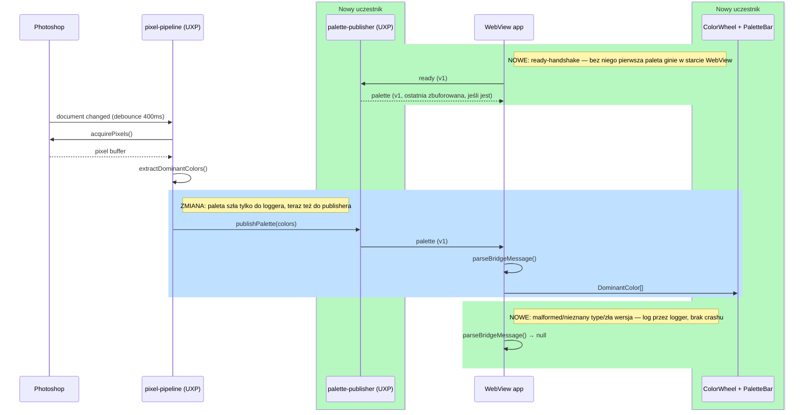

# Design — Step 3: Color Wheel + Palette UI

Design document for [issue #5](https://github.com/matee911/colors/issues/5). Covers the typed UXP→WebView bridge,
the WebView presentation layer (color wheel + palette bar) and the pipeline wiring that makes the panel update
while retouching.

## TL;DR

- **What**: the first visual MVP — the palette that Step 2 only logged now reaches the WebView over a versioned,
  tagged message contract and is drawn as dots on an HSL wheel plus a weighted palette bar.
- **How**: a `BridgeMessage` tagged union (`type` + `version`) owned by a context-neutral module, a ready-handshake
  so the first palette is never lost to WebView startup, and two presentational React components that update
  attributes on a stable element set instead of re-creating the DOM.
- **Consequence**: `pixel-pipeline.ts` stops being a logger and gains one collaborator — a palette sink it calls
  after every extraction. The WebView stops being a placeholder page.
- **Value**: the plugin becomes usable for the first time. Step 4 (harmony overlay) extends the same union with a
  second variant instead of renegotiating the contract.
- **Split**: **two stacked PRs** — contract+transport first, presentation second — to stay under the 500-line limit.

## Scope boundary

Out of scope, deliberately:

- harmony overlay, scoring, ideal-angle rings — Step 4 owns those; the message union is designed to accept a second
  variant, but no such variant is added here
- near-black/near-white filtering and empty/edge-case polish — Step 5
- WebView→UXP commands (e.g. panel asking for a re-analysis). The only WebView→UXP message here is `ready`.

## Responsibility split (DRY / SRP / Interface Segregation / Bounded Context)

| Module                                                | Responsibility                                                                   | Knows about                       |
| ----------------------------------------------------- | -------------------------------------------------------------------------------- | --------------------------------- |
| `src/algorithms/types.ts`                             | Color vocabulary (`DominantColor`, `Palette`) — unchanged                        | nothing                           |
| `src/bridge/messages.ts` **(new)**                    | The wire contract: `BridgeMessage` union, `BRIDGE_VERSION`, `parseBridgeMessage` | `algorithms/types.ts` only        |
| `src/uxp/palette-publisher.ts` **(new)**              | UXP side of transport: handshake state, last-palette buffer, send                | `bridge/messages.ts`, WebView API |
| `src/uxp/pixel-pipeline.ts` **(modified)**            | Orchestration: event → debounce → acquire → extract → publish                    | both sides                        |
| `webview-ui/src/palette-store.ts` **(new)**           | WebView side of transport: validate incoming message, expose palette to React    | `bridge/messages.ts`              |
| `webview-ui/src/components/color-wheel.tsx` **(new)** | Draw wheel + one dot per color                                                   | `algorithms/types.ts`             |
| `webview-ui/src/components/palette-bar.tsx` **(new)** | Draw weighted swatch strip                                                       | `algorithms/types.ts`             |
| `webview-ui/src/panel.scss` **(new)**                 | Panel styles bound to the host color-scheme variables                            | nothing                           |
| `webview-ui/src/wheel-geometry.ts` **(new)**          | Dot placement and swatch widths (pure)                                           | `algorithms/types.ts`             |
| `webview-ui/src/render-budget.ts` **(new)**           | Reports render time against the 16ms budget                                      | `lib/logger.ts`                   |

The boundary that matters: **`src/bridge/messages.ts` imports nothing from `src/uxp/` and nothing from React.** Both
contexts import the same module, so the contract cannot drift between sender and receiver — this is the DRY argument
for a third location rather than defining the shape twice or having the WebView import from `src/uxp/`.

`ColorWheel` and `PaletteBar` take `DominantColor[]` props and hold no state: per CLAUDE.md the WebView context is
"purely presentational", so validation and message handling stay out of the components (Interface Segregation — a
component that only draws should not receive a bridge message it has to interpret).

### Suggested optional prerequisite refactor

**None required.** Considered and rejected: replacing Comlink RPC with raw `postMessage` before this step. Comlink
already carries the color-scheme call, and swapping transports would be a refactor of working code that the task
does not require (CLAUDE.md: surgical changes). The typed contract sits _on top of_ the existing Comlink method call,
so nothing about the transport changes.

## Data structures

No persisted schema, no database, no migration — this repo has none, so there is no ERD to draw. The change is a new
in-memory wire type:

```ts
// src/bridge/messages.ts — new
export const BRIDGE_VERSION = 1;

export type BridgeMessage =
  | {
      type: "palette";
      version: number;
      payload: { colors: DominantColor[]; timestamp: number };
    }
  | { type: "ready"; version: number };
```

`type` is the discriminant Step 4 extends (`"harmony"`), `version` is what lets a receiver reject a message from a
future schema loudly instead of half-reading it. Payloads are plain objects only — no `Map`/`Set`/class instances —
because the message crosses a structured-clone boundary; `parseBridgeMessage` enforces this by construction and a
JSON round-trip test guards it.

## Message flow



## Decision table — `parseBridgeMessage`

The one decision point in this change, spelled out so the tests can be read against it:

| Input                                                                    | Result  | Logged as |
| ------------------------------------------------------------------------ | ------- | --------- |
| `{type:"palette", version:1, payload:{…}}`                               | message | —         |
| `{type:"ready", version:1}`                                              | message | —         |
| `undefined` / `null` / `"palette"` / `42`                                | `null`  | `warn`    |
| `{version:1, payload:{…}}` (no `type`)                                   | `null`  | `warn`    |
| `{type:"harmony", version:1, …}` (unknown)                               | `null`  | `warn`    |
| `{type:"palette", version:2, …}` (future)                                | `null`  | `warn`    |
| `{type:"palette", version:1}` (no payload)                               | `null`  | `warn`    |
| `{type:"palette", version:1, payload:{colors:"red"}}` (wrong field type) | `null`  | `warn`    |

A rejected message never throws and never reaches a component — the panel keeps showing the last good palette.

## Performance review

- **Render budget**: <16ms per update (Performance Budget, `docs/analysis-implementation-approach.md`). With ≤8 dots
  and ≤8 swatches this is not in question; what _would_ put it in question is re-creating the DOM per update, so the
  wheel background is painted once (static conic/radial CSS gradient) and only dot `cx`/`cy`/`r`/`fill` change.
- **Update frequency**: bounded by the existing 400ms debounce — the bridge adds no timer of its own.
- **Message size**: ≤8 colors × ~10 numbers. Structured-clone cost is negligible; no batching or throttling needed.
- **Blast radius**: none at scale — single document, single panel, no fan-out, no storage, no N+1 anything.

## Security review

- No new permissions. `requiredPermissions.webview` and manifest v6 already exist in `uxp.config.ts` and must stay
  (ADR-002, ADR-006) — a regression there silently kills this feature.
- The WebView renders only numbers, and colors are written as `rgb(...)` from numeric channels — no user-supplied
  string reaches `innerHTML`, `style` as raw text, or a URL.
- `uxpAllowInspector` stays dev-only; unchanged by this step.
- Untrusted-input posture: the WebView treats every inbound message as untrusted and validates it before use, which
  is what the malformed-message AC is actually protecting.

## ADR compliance

- **ADR-002 (WebView for UI)** — satisfied: the wheel is rendered in the WebView, not UXP native Canvas/SVG.
- **ADR-006 (manifest v6)** / **ADR-005** — unchanged; no manifest edits beyond what already ships.
- **ADR-003 (MMCQ)** — untouched; this step consumes the extractor's output and does not re-litigate the algorithm.
- No new ADR required: nothing here reverses or supersedes an accepted decision. (Contract versioning is an
  implementation of ADR-002's "data must be serialized across the boundary", not a competing decision.)

## Interfaces

- **UI** — yes, this _is_ the UI step: the panel gains a color wheel and a palette bar. Design-system check: this repo
  documents no component library; the convention it does have is the UXP host color scheme already piped into CSS
  variables by `webview-api.ts`, and the new theme builds on those variables rather than hardcoding a second palette.
- **CLI** — no. Nothing here is scriptable and no build/CLI command changes.
- **Code** — `src/bridge/messages.ts` is the public seam for Step 4; everything else is internal to its context.

## Repo conventions (CLAUDE.md)

- Logging goes through `src/lib/logger.ts` — including in the WebView context, no raw `console.*` in new code.
- Domain logic uses Gherkin + `@amiceli/vitest-cucumber`; bridge/UI plumbing stays plain AAA `describe`/`it`
  (confirmed by the issue's own comment). Nothing here is domain logic, so: AAA.
- `executeAsModal` scopes and `PhotoshopImageData` disposal are untouched by this step.
- No feature flags, audit log, or error-tracking requirements are defined in this repo — nothing to add.

## Gherkin

```gherkin
Feature: Color wheel and palette bar

  Scenario: Color wheel displays dominant colors
    Given a palette of dominant colors has been extracted
    When the WebView receives the palette over the bridge
    Then the wheel renders one dot per color, positioned by hue angle and saturation radius, sized by weight

  Scenario: Palette bar reflects weights
    Given a palette of dominant colors
    When it is rendered in the panel
    Then a horizontal bar shows one swatch per color, each proportional in width to that color's weight

  Scenario: Live updates during editing
    Given the panel is open and showing a palette
    When the user adjusts curves, levels or hue/saturation
    Then the dots and swatches update without a manual refresh

  Scenario: First palette survives WebView startup
    Given the UXP context published a palette before the WebView finished loading
    When the WebView announces itself as ready
    Then it receives the buffered palette and renders it

  Scenario: Malformed bridge message
    Given the WebView receives a message that is not a valid bridge message
    When it is handled
    Then the error is logged via the logger, the panel does not crash, and the last good palette stays on screen

  Scenario: Message from a future schema version
    Given the WebView receives a palette message with an unsupported version
    When it is handled
    Then it is rejected and logged, exactly like a malformed message
```

## Acceptance criteria

Contract + transport (PR 1):

1. `BridgeMessage` is a tagged union with `type` and `version`; `BRIDGE_VERSION` is exported from one module imported
   by both contexts.
2. `parseBridgeMessage` returns `null` and logs a warning for every row of the decision table above; it never throws.
3. A JSON round-trip test proves a palette message is structured-clone safe (plain objects only).
4. The UXP side buffers the most recent palette and sends it when the WebView reports `ready`.
5. `yarn verify` (lint, format, typecheck, test, build) passes.

Presentation (PR 2):

6. The wheel renders one dot per dominant color: hue → angle, saturation → distance from center, weight → radius.
7. The palette bar renders one swatch per color with width proportional to weight.
8. Dots and swatches update live in Photoshop while adjusting curves/levels/hue-sat, with no manual refresh.
9. The panel's dark theme is derived from the UXP host color scheme and verified side-by-side against the Photoshop
   panel chrome.
10. A wheel update stays under the 16ms render budget, measured in the WebView.
11. No errors in the UDT console during a full session (open panel → edit → close).
12. Every scenario above is exercised manually in Photoshop, not only in unit tests.

## PR split

**Yes — this change must be split.** Estimated diff is ~750 lines, above the 500-line limit.

1. **PR 1 — bridge contract + transport** (`src/bridge/messages.ts`, `src/uxp/palette-publisher.ts`, pipeline wiring,
   `bridge.test.ts`, this document). Base: `main`, opened as **draft** so it cannot merge out from under PR 2.
2. **PR 2 — color wheel + palette bar + theme** (`webview-ui/src/**`, component tests). Base: PR 1's branch.

Both PR descriptions carry the message-flow diagram above, since the reviewer reads the description first.
