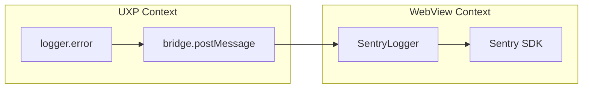

# Implementation Plan — MVP

Real-time color harmony analysis plugin for Photoshop. Plan follows vertical slicing — each step delivers a working, testable increment that can be loaded in Photoshop.

## Overview

```mermaid
graph LR
    S0[Step 0<br/>Scaffold +<br/>Hello World] --> S1[Step 1<br/>Pixel<br/>Pipeline]
    S1 --> S2[Step 2<br/>Color<br/>Extraction]
    S2 --> S3[Step 3<br/>Color Wheel<br/>+ Palette UI]
    S3 --> S4[Step 4<br/>Harmony<br/>Detection]
    S4 --> S5[Step 5<br/>Polish +<br/>Edge Cases]

    style S0 fill:#444,stroke:#888
    style S1 fill:#444,stroke:#888
    style S2 fill:#444,stroke:#888
    style S3 fill:#4a7,stroke:#888
    style S4 fill:#47a,stroke:#888
    style S5 fill:#444,stroke:#888
```



**S3** = first visual MVP. **S4** = core value proposition.

---

## Step 0: Scaffold & Hello World

**Goal**: Confirm tooling works end-to-end (UXP context → WebView → postMessage).

### Scope

- `yarn create bolt-uxp` (React + TypeScript)
- Configure `uxp.config.ts`: manifest v6, apiVersion 2, WebView permissions, PS 27.0+ target
- Empty panel loads in Photoshop
- WebView renders "Hello" text received via `postMessage` from UXP context
- Setup **Vitest** with first smoke test
- Create **logger abstraction** (`src/lib/logger.ts`) with `info`, `warn`, `error` methods
  - Default implementation: `console.*` with structured prefix `[ColorHarmony]`
  - Designed for future swap to Sentry/external provider (see [Future](#future-scope))

### Tests

- Smoke test: `logger.info/warn/error` don't throw
- Smoke test: shared types importable

### Definition of Done

- [ ] `yarn build` succeeds
- [ ] `yarn dev` starts, plugin loads in Photoshop via UDT
- [ ] WebView displays "Hello" received from UXP context
- [ ] `yarn test` passes (smoke tests green)
- [ ] Logger outputs to UDT console

---

## Step 1: Pixel Acquisition Pipeline

**Goal**: Confirm live pixel data flows from Photoshop to plugin on every edit.

### Scope

- `src/uxp/imaging.ts` — `getPixels` wrapper with `executeAsModal`, `targetSize: {width: 100}`, auto-dispose
- `src/uxp/events.ts` — `addNotificationListener` on `set`, `select`, `make`, `delete`, `historyStepBackward`, `historyStepForward`
- `src/lib/debounce.ts` — generic debounce utility (pure, testable)
- Wire together: PS event → debounce(400ms) → getPixels → log pixel count + timing to console

### Tests

- `debounce.test.ts`: fires after delay, resets on repeated calls, cancellable
- `imaging.test.ts`: dispose called after callback (mock `PhotoshopImageData`)

### Definition of Done

- [ ] Panel logs `"Got N pixels in Xms"` after every brush stroke / adjustment in PS (N varies with document aspect ratio — `targetSize` constrains width only)
- [ ] No pixel data leaks (dispose always called)
- [ ] Debounce prevents excessive calls during slider drags
- [ ] `yarn test` passes

---

## Step 2: Color Extraction

**Goal**: Extract dominant colors from pixel data. Algorithm fully unit-tested without Photoshop.

### Scope

- `src/algorithms/types.ts` — `RGBColor`, `HSLColor`, `DominantColor` (with weight), `Palette`
- `src/algorithms/color-convert.ts` — `rgbToHsl`, `hslToRgb`
- `src/algorithms/color-extraction.ts` — MMCQ via `quantize` library, returns 5-8 `DominantColor`s
- Integrate with pipeline: extracted palette logged to console as `[{r,g,b,h,s,l,weight}]`

### Tests

- `color-convert.test.ts`: known RGB↔HSL pairs (red=0°, green=120°, blue=240°, white, black, grays)
- `color-convert.test.ts`: round-trip consistency `rgb → hsl → rgb`
- `color-extraction.test.ts`: single-color image → 1 dominant color
- `color-extraction.test.ts`: two-color split image → 2 dominant colors with ~50/50 weight
- `color-extraction.test.ts`: real-world-like RGBA buffer → returns 5-8 colors sorted by weight

### Definition of Done

- [ ] Console shows extracted palette after each edit in PS
- [ ] Extraction completes in <50ms (logged timing)
- [ ] All unit tests pass on pure data (no PS dependency)
- [ ] `yarn test` passes

---

## Step 3: Color Wheel + Palette UI

**Goal**: First visual MVP — user sees dominant colors on a color wheel, updating live during editing.

### Scope

- `src/uxp/bridge.ts` — typed `postMessage` bridge (UXP → WebView), message schema
- `src/webview/index.html` + `src/webview/app.ts` — WebView entrypoint, message handler
- `src/webview/components/ColorWheel.ts` — HSL color wheel (Canvas or SVG), dominant colors as positioned dots (hue=angle, saturation=distance from center)
- `src/webview/components/PaletteBar.ts` — horizontal bar of dominant color swatches with weight-proportional width
- `src/webview/styles/main.css` — dark theme matching Photoshop UI
- Dot size proportional to color weight

### Tests

- `bridge.test.ts`: message serialization/deserialization contract (UXP sends X, WebView receives X)
- `bridge.test.ts`: handles malformed messages gracefully (logs via logger, doesn't crash)

### Definition of Done

- [ ] Color wheel renders in the panel with positioned dots
- [ ] Dots update live when user adjusts curves/levels/hue-sat
- [ ] Palette bar shows dominant colors below the wheel
- [ ] Dark theme consistent with Photoshop
- [ ] No errors in UDT console
- [ ] `yarn test` passes

---

## Step 4: Harmony Detection & Overlay

**Goal**: Core value — the user sees whether the frame shows a color harmony and which colors form it.

Superseded in detail by [ADR-008](adr/008-harmony-detection.md) and [docs/design-harmony-detection.md](design-harmony-detection.md): this step originally called for a match percentage, and that turned out to be the wrong answer. A number in the middle of the range reads as a weak match when it means no match. The answer is the harmony or nothing.

### Scope

- `src/algorithms/harmony.ts`:
  - Geometric templates: complementary, split-complementary, triadic, tetradic, square
  - Arc-decided: monochromatic and analogous, at any color count and spacing
  - Returns the harmony and which colors form it, or `null`
- WebView:
  - `harmony-overlay.tsx` — draws the shape through the dots that form the harmony
  - `harmony-label.tsx` — names the harmony, or says there is none
- Bridge extended: palette + harmony in one atomic message

### Tests

`src/__tests__/harmony.feature` + `harmony.feature.test.ts` (BDD per CLAUDE.md), one scenario per row of the decision table in the design document — including the 359°/1° wraparound, a fully desaturated palette, a trace color that neither completes nor breaks a harmony, and order independence.

### Definition of Done

- [ ] Harmony name displayed in the panel, or that there is none
- [ ] The shape drawn through the dots that form it on the color wheel
- [ ] Both update live with edits
- [ ] Harmony detection <5ms (logged)
- [ ] All unit tests pass
- [ ] `yarn test` passes

---

## Step 5: Polish & Edge Cases

**Goal**: Production-quality behavior. Plugin doesn't crash or mislead on unexpected input.

### Scope

- Filter near-black (L<5%) and near-white (L>95%) from dominant colors before harmony analysis
- Saturation weighting: refine how desaturated colors are excluded from harmony detection
- Fallback polling: re-analyze every 5s even without events (catches missed events)
- Graceful states:
  - No document open → "Open a document to analyze"
  - Document has no pixel content → "No pixel data available"
  - Non-RGB color mode (CMYK, Lab) → handle or show warning
- Performance profiling: measure full pipeline end-to-end, tune `targetSize` and debounce
- Logger: structured error logging for all failure paths

### Tests

- `color-extraction.test.ts`: all-black image → empty/minimal palette
- `color-extraction.test.ts`: all-white image → empty/minimal palette
- `color-extraction.test.ts`: grayscale image → low-saturation results
- `harmony.feature`: empty palette → no crash, no harmony reported
- `harmony.feature`: single color palette → monochromatic
- `debounce.test.ts`: rapid fire → only last call executed

### Definition of Done

- [ ] All edge case states render appropriate UI messages
- [ ] No unhandled errors in UDT console across 30min editing session
- [ ] End-to-end pipeline <700ms confirmed on 50MP+ document
- [ ] All unit tests pass
- [ ] `yarn test` passes
- [ ] **MVP complete** — ready for internal use

---

## Future Scope (post-MVP)

Not in scope now, but architecture supports these without major refactor:

| Feature                                            | Effort | Enabled by                                                                                                   |
| -------------------------------------------------- | ------ | ------------------------------------------------------------------------------------------------------------ |
| **Sentry integration**                             | Low    | `logger.ts` abstraction — swap implementation to `@sentry/browser` in WebView, forward UXP errors via bridge |
| "Nudge" suggestions ("shift hue +15° for triadic") | Medium | The match already carries how far off the worst color is                                                     |
| Region of Interest (analyze selection only)        | Medium | `sourceBounds` param in `getPixels`                                                                          |
| Per-layer analysis                                 | Medium | `layerID` param in `getPixels`                                                                               |
| Palette export (ASE, JSON, CSS)                    | Low    | Palette data already structured                                                                              |
| Configurable color count / sensitivity             | Low    | Parameterize MMCQ max colors                                                                                 |
| Marketplace distribution                           | Medium | `.ccx` packaging, signing, notarization                                                                      |

## Logger Abstraction Design

Introduced in Step 0, used everywhere. Designed for future provider swap.

```typescript
// src/lib/logger.ts
interface Logger {
  info(msg: string, data?: Record<string, unknown>): void;
  warn(msg: string, data?: Record<string, unknown>): void;
  error(msg: string, error?: Error, data?: Record<string, unknown>): void;
}

// Default: console-based
// Future: swap to SentryLogger that forwards to @sentry/browser in WebView
```

Key constraint: UXP context has no `@sentry/browser` (not a browser). Future Sentry integration routes UXP errors via `postMessage` bridge to WebView where Sentry SDK lives.


