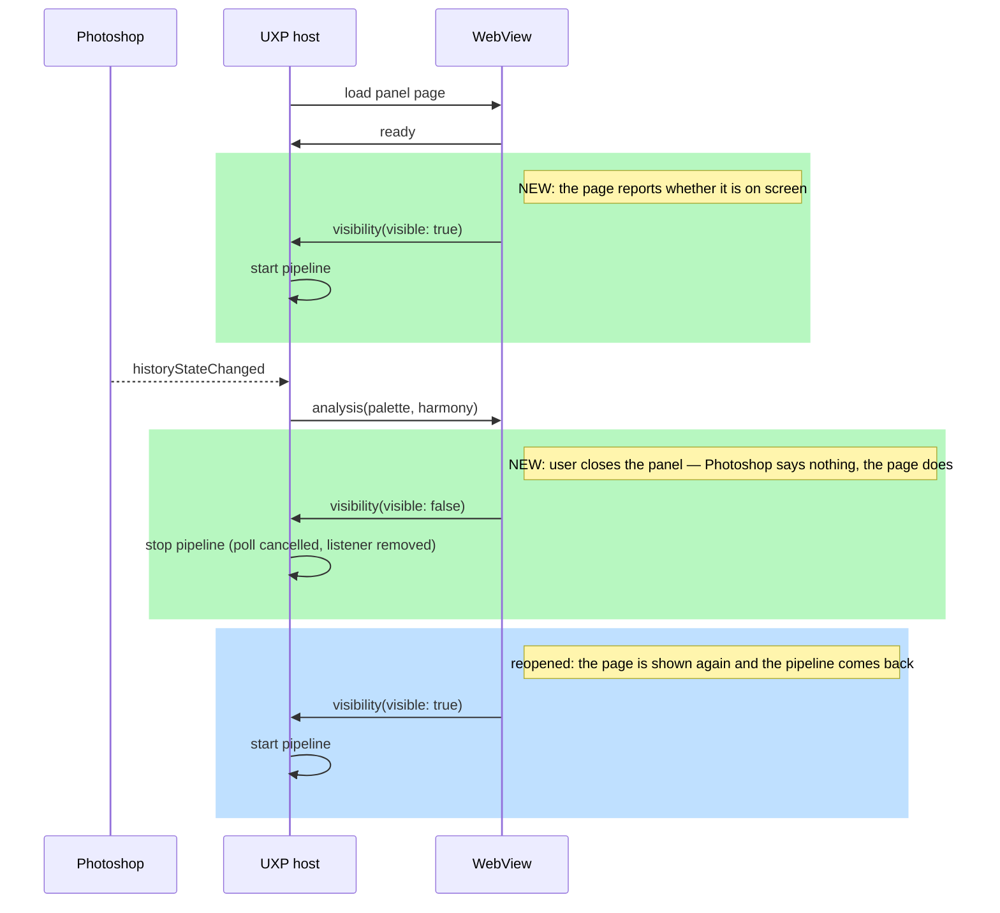

# Stopping the pipeline when the panel is not on screen

## TL;DR

- Closing the panel does not stop the plugin: the React tree never unmounts, so the teardown that
  cancels the poll and removes the host listener never runs. The panel keeps reading the user's
  document every 5 seconds for the rest of the session.
- Photoshop offers no callback for it. Measured live: the host calls `create` and `show` at plugin
  load and calls **nothing at all** when the panel is closed.
- The WebView does know. `document.visibilityState` flips to `hidden`, `requestAnimationFrame`
  stops firing, and the WebView can still talk over the bridge — so the panel's own page is the
  signal, and it only has to say so.
- Adds one message type to the bridge contract (`visibility`) and one inbound router; the pipeline
  gains a start/stop owner that is not React's mount.

## Why this design, and what was ruled out

Three mechanisms were considered. Two were tested in Photoshop 27.9.1 rather than argued about,
because the type declarations describe none of this.

| Mechanism                                                                                    | Result                                                                                                                                                                                                |
| -------------------------------------------------------------------------------------------- | ----------------------------------------------------------------------------------------------------------------------------------------------------------------------------------------------------- |
| `uxp.entrypoints.setup({ panels: { [id]: { show, hide } } })` registered from a React effect | Handlers never fire at all — `shows=0 hides=0`. The table is installed after the host has already created and shown the panel.                                                                        |
| Same, registered at plugin load (module import, before `ReactDOM.render`)                    | `create=1 shows=1` — the API works — but closing the panel yields `hides=0 destroy=0`. The host announces the panel appearing and says nothing when it goes away.                                     |
| The WebView reports its own visibility                                                       | Works. Open: `visibilityState="visible"`, rAF frame counter rising. Closed: `visibilityState="hidden"`, `hidden=true`, frame counter frozen, and Comlink calls from the WebView still reach the host. |

`entrypoints.setup` is therefore **not** the fix, and this document exists partly so the next person
does not spend the afternoon re-discovering that. It is not registered at all in the final change:
`show` alone cannot stop anything, and a lifecycle table that handles half the transitions is worse
than none — it reads as if the case were covered.

The frozen frame counter is corroboration, not the mechanism. `visibilitychange` is a documented DOM
event with a single meaning; a heartbeat that infers hiding from missing frames would need a timeout,
and every timeout is a wrong answer for some machine.

## Responsibilities

| Module                                     | Gains                                                    | Why there                                                                                                                                                                             |
| ------------------------------------------ | -------------------------------------------------------- | ------------------------------------------------------------------------------------------------------------------------------------------------------------------------------------- |
| `src/bridge/messages.ts`                   | `VisibilityMessage`, its factory and its validation      | The contract is already the single place both sides agree on what may cross. A second, unvalidated channel would be the one place a malformed message reaches the host unchecked.     |
| `webview-ui/src/panel-visibility.ts` (new) | Reads `document.visibilityState`, sends on change        | Only the WebView can observe this. Kept out of `webview-setup.ts` so the handshake file keeps doing one thing.                                                                        |
| `src/uxp/webview-inbox.ts` (new)           | Parses every inbound message once, dispatches by type    | Today `palette-publisher` owns the inbound half because it was the only consumer. With a second consumer that is no longer true, and the publisher has no business seeing visibility. |
| `src/uxp/palette-publisher.ts`             | Loses `handleWebviewMessage`, gains `markWebviewReady()` | It keeps the handshake state it already owned; it stops being the door.                                                                                                               |
| `src/main.tsx`                             | Starts the pipeline on visible, stops it on hidden       | The component already owns the pipeline's lifetime. This replaces "for as long as React is mounted" with "for as long as the panel is on screen".                                     |

`BRIDGE_VERSION` is not bumped: the contract's own note says a new `type` needs no bump, because the
discriminant already tells an older receiver it does not know the message.

## Flow



## Decision table

| Inbound                                       | Pipeline running? | Action                                |
| --------------------------------------------- | ----------------- | ------------------------------------- |
| `visibility(true)`, pipeline stopped          | no                | start it                              |
| `visibility(true)`, pipeline already running  | yes               | nothing — the host may repeat a state |
| `visibility(false)`, pipeline running         | yes               | stop it                               |
| `visibility(false)`, pipeline already stopped | no                | nothing                               |
| malformed / unknown type                      | either            | discard and log, exactly as today     |

Repeats are ordinary, not defensive: `visibilitychange` can fire for reasons other than the panel
opening and closing, and the WebView also sends its state once at handshake.

## Known cost: the first palette after reopening

`startPixelPipeline` arms the idle poll rather than reading straight away, so a panel reopened onto
an untouched document shows the palette it had before it was hidden for up to one poll interval. Any
edit in the meantime goes through the ordinary debounce, so this is only visible to someone who
opens the panel and then does nothing.

Reading once on start would remove it, and it is deliberately not in this change: it alters when
every pipeline takes its first look, not just a reopened one, and it lands on seven existing tests
that assert nothing is read until something happens. That is its own change with its own argument to
make.

## Performance and security

The change removes work; it adds one boolean message per visibility transition. No new host API,
no new timer, no new data crossing the bridge — `visibility` carries a single boolean, and nothing
derived from the user's image travels in this direction.

The new message goes through the same validation as every other inbound message, and the router
parses once before dispatch, so an unknown or malformed payload reaches neither consumer.

## Interfaces

- **UI**: none. The panel looks and behaves the same while it is open.
- **CLI**: none.
- **Code**: `parseBridgeMessage` gains a variant; `handleWebviewMessage` moves module.

## ADR

No accepted ADR covers scheduling or lifecycle. ADR-002 (WebView for UI) is the neighbour, and the
split it mandates holds: acquisition and analysis stay in the UXP context, and the WebView sends a
fact about itself rather than driving Photoshop. No ADR is owed.

## Spec

```gherkin
Scenario: The panel is closed
  Given the panel is open and the pipeline is running
  When the user closes the panel
  Then the WebView reports that it is hidden
  And no further pixel acquisition happens

Scenario: The panel is reopened
  Given the panel was closed and the pipeline is stopped
  When the user opens the panel again
  Then the pipeline starts
  And a palette appears without reloading the plugin

Scenario: A repeated state changes nothing
  Given the pipeline is running
  When the WebView reports that it is visible again
  Then the pipeline is not restarted
```

## Acceptance criteria

- [ ] With the panel closed, no `Got … pixels` line appears in the UDT console for at least 30 s
- [ ] Reopening the panel produces a palette without a plugin reload
- [ ] A repeated `visible` does not restart a running pipeline, and a repeated `hidden` is a no-op
- [ ] The visibility message is validated like every other inbound message; a malformed one is
      discarded and logged rather than acted on
- [ ] Confirmed in Photoshop for a floating panel and for a docked one
- [ ] `yarn verify` passes, coverage gate included

Estimated size: ~180 lines including tests — one PR, no split needed.
