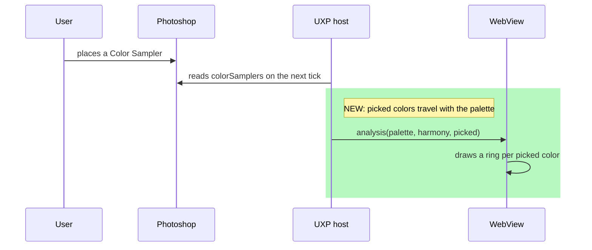

# Picked points on the wheel

## TL;DR

- The retoucher can put a point on the image and see where that exact color sits on the wheel, next
  to the dominant colors the plugin found on its own.
- The picking is Photoshop's own Color Sampler tool. The plugin adds no click target of its own,
  because it cannot: a UXP panel never sees a click on the canvas.
- Picked colors are drawn as diamonds, never as dots, and never take part in harmony detection.
  They are what the user asked about, not what the image is made of.

## What the live host confirmed, and what it did not

This was designed against `Document.colorSamplers` as the installed type declarations describe it,
then run in Photoshop. Confirmed there: reading `.color` needs no modal scope, a sampler over a
transparent pixel reports `NoColor`, and the collection iterates the way this expects.

Two questions are still open, and the reader is defensive about both rather than answering them.
What a `.color` getter that _hangs_ rather than throws would do to the tick is untested — a
synchronous read has no timeout to give it. Whether the sampler honours the tool's Sample Size, or
always reports a single pixel, is unknown. The shape check instead of a class-name check, the
`try/catch` around the whole read and the empty result on failure all stay: a host that will not
answer costs the diamonds and not the palette.

## Why the sampler, and not a click

A UXP panel is a separate surface from the document window. It receives no pointer events from the
canvas, there is no "where did the user click" event in the notification API, and a plugin cannot
add a tool. Anything that looks like picking a point in the image has to be picked with a Photoshop
tool.

The Color Sampler tool is that tool, and it already does exactly this job: the user places up to ten
markers, Photoshop keeps them pinned to their coordinates through edits, and each one reports the
color underneath it. `Document.colorSamplers` exposes them with `position` and `color` (typings
declare it from Photoshop 24.0; this plugin's floor is 27.0).

The alternative — reading the foreground color, which the eyedropper sets — was rejected: it holds
one color, it is overwritten by anything else that sets a color, and the user cannot see which
pixel it came from once the cursor has moved.

## Responsibilities

| Module                                      | Gains                                                         | Why there                                                                                                                               |
| ------------------------------------------- | ------------------------------------------------------------- | --------------------------------------------------------------------------------------------------------------------------------------- |
| `src/uxp/color-samplers.ts` (new)           | `readPickedColors()`                                          | The one place that knows the host's sampler collection. Returns plain colors, so nothing downstream touches a Photoshop object.         |
| `src/algorithms/types.ts`                   | `PickedColor`                                                 | A color with a position on the wheel and nothing else — no weight, because a picked point does not cover any share of the image.        |
| `src/bridge/messages.ts`                    | `picked` on the analysis payload, capped and validated        | Same trip as the palette it sits beside; a separate message could arrive out of step and draw diamonds for a frame that has moved on.   |
| `src/uxp/pixel-pipeline.ts`                 | Reads the samplers, and counts them in "has anything changed" | The dedupe added for the idle poll compares pixels, and moving a sampler changes no pixels — without this the ring would not follow it. |
| `webview-ui/src/components/color-wheel.tsx` | Draws the diamonds                                            | Same coordinate space as the dots, so a diamond and a dot at the same hue land on the same spot.                                        |

## What picked points do not do

They do not vote on harmony. Detection reads the dominant colors, which are what the image is made
of; a sampler is a question the user asked about one pixel. Letting a picked point complete a triad
would mean the panel's answer changes because someone put a marker down, which is not a fact about
the photograph.

They also carry no weight, and so no dot size: a point is a point.

## Flow



## Decision table

| Sampler state                  | Result                                                                             |
| ------------------------------ | ---------------------------------------------------------------------------------- |
| None placed                    | `picked` is empty; the wheel looks exactly as it does today                        |
| Over a colored pixel           | A ring at that hue and saturation                                                  |
| Over a fully transparent pixel | Skipped — the host reports `NoColor`, and there is no color to place               |
| Moved, with no pixel changed   | The ring follows on the next tick, because picked colors count in the change check |
| More than the contract's cap   | The message is refused whole, as any oversized payload is                          |

## Performance and security

One collection read per analysis, bounded by the contract's cap in the reader itself, and expected
to sit outside any modal scope. No new timer, no new message, and nothing about the image that was not already crossing
the bridge — a picked color is one pixel of a document the palette already describes.

## ADR

No accepted ADR is affected. ADR-009 governs what a harmony is, and picked points deliberately stay
out of detection, which is the same boundary from the other side.

## Interfaces

- **UI**: diamonds on the wheel. No new control, no new panel state — placing a sampler is done in
  Photoshop.
- **Code**: `AnalysisMessage["payload"]` gains `picked`, and `BRIDGE_VERSION` goes from 3 to 4 —
  an older receiver would drop the field silently, and an older sender is now missing one.

## Spec

```gherkin
Scenario: A picked point appears on the wheel
  Given the user has placed a color sampler on a red pixel
  When the pipeline analyzes the document
  Then the panel draws a ring at that red's position
  And the dominant colors are unchanged

Scenario: A picked point does not complete a harmony
  Given dominant colors that form no harmony
  And a picked point that would complete a triad
  When harmony detection runs
  Then no harmony is reported

Scenario: Moving a sampler moves the ring
  Given a picked point is on the wheel
  When the sampler is moved to a different color and no pixel changes
  Then the ring follows on the next analysis
```

## Acceptance criteria

- [ ] A color sampler placed in Photoshop shows up as a ring on the wheel
- [ ] Removing it removes the ring
- [ ] Moving it moves the ring, even though no pixel changed
- [ ] A sampler over a transparent pixel is skipped rather than drawn at an invented hue
- [ ] Picked points never appear in a harmony's colors
- [ ] Confirmed in Photoshop with the Color Sampler tool
- [ ] `yarn verify` passes
