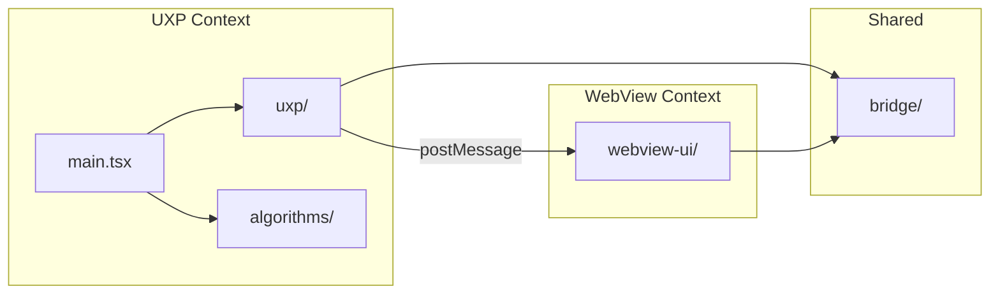

# Project Structure

Suggested directory layout for the Color Harmony Photoshop plugin, using Bolt UXP (Vite + React + TypeScript).

## Directory Tree

```
colors/
├── CLAUDE.md                     # AI assistant instructions
├── CONTRIBUTING.md               # Setup, dev workflow, PR process
├── docs/
│   ├── adr/                      # Architecture Decision Records
│   ├── analysis-*.md             # Research & analysis documents
│   └── project-structure.md      # This file
├── plugin/
│   ├── manifest.json             # Generated UXP manifest (source: uxp.config.ts)
│   ├── icons/                    # Plugin icons (23x23, 48x48 PNG)
│   └── index.html                # UXP entrypoint (loads bundle)
├── src/
│   ├── main.tsx                  # UXP entrypoint, event listeners, panel lifecycle
│   ├── lib/
│   │   ├── logger.ts             # Logger abstraction (console now, Sentry later)
│   │   └── debounce.ts           # Generic debounce utility
│   ├── uxp/
│   │   ├── imaging.ts            # getPixels wrapper, executeAsModal, dispose
│   │   ├── events.ts             # PS event listener setup & management
│   │   ├── pixel-pipeline.ts     # Wires document changes to debounced acquisition
│   │   └── palette-publisher.ts  # UXP side of the bridge: handshake, buffer, send
│   ├── bridge/
│   │   └── messages.ts           # Wire contract, imported by BOTH contexts
│   ├── algorithms/
│   │   ├── color-extraction.ts   # MMCQ / K-Means dominant color extraction
│   │   ├── harmony.ts            # Harmony detection
│   │   ├── color-convert.ts      # RGB <-> HSL <-> HSV conversions
│   │   └── types.ts              # Shared types (Color, DominantColor, HarmonyMatch)
│   └── __tests__/
│       ├── color-extraction.test.ts
│       ├── harmony.feature
│       ├── harmony.feature.test.ts
│       └── color-convert.test.ts
├── webview-ui/                   # WebView bundle — its own Vite project
│   └── src/
│       ├── main-webview.tsx      # WebView entrypoint
│       ├── palette-store.ts      # Validates inbound messages, holds the palette
│       ├── wheel-geometry.ts     # Dot placement & swatch widths (pure)
│       ├── render-budget.ts      # Reports render time against the 16ms budget
│       ├── panel.scss            # Panel styles, driven by the host color scheme
│       └── components/
│           ├── color-wheel.tsx   # SVG wheel with one dot per dominant color
│           └── palette-bar.tsx   # Weighted swatch strip
├── uxp.config.ts                 # Bolt UXP config (manifest, hosts, panels)
├── vite.config.ts                # Vite config (dual build: UXP + WebView)
├── package.json
├── tsconfig.json
└── .gitignore
```

## Key Architectural Boundaries



### UXP Context (`src/main.tsx`, `src/uxp/`, `src/algorithms/`)

- Runs in UXP runtime (not a browser)
- Has access to Photoshop APIs (`require("photoshop")`)
- Handles pixel acquisition, color extraction, harmony detection
- No DOM rendering (besides minimal panel shell)

### WebView Context (`webview-ui/`)

- Runs in embedded browser (Edge/Safari)
- Full HTML5 Canvas, SVG, CSS
- Receives processed data via `postMessage`
- Presentational — no PS API access. The one thing it reports back is whether the panel is on
  screen; see [panel-visibility.md](panel-visibility.md)

### Bridge (`src/bridge/`)

- The wire contract only: message shapes, schema version, validation
- Imported by **both** contexts, so sender and receiver cannot drift apart
- Free of Photoshop APIs, React and the DOM

### Algorithms (`src/algorithms/`)

- Pure functions, no side effects, no PS dependencies
- Fully unit-testable in Node.js
- Could be extracted to a standalone library

## Build Output

Vite produces two bundles:

1. **UXP bundle** -> `plugin/index.js` (loaded by manifest.json)
2. **WebView bundle** -> `public/webview-ui/*.html` (single-file, loaded by the WebView element)

## Naming Conventions

- Files: `kebab-case.ts`
- Types/Interfaces: `PascalCase`
- Functions: `camelCase`
- Constants: `UPPER_SNAKE_CASE`
- Test files: `*.test.ts` co-located in `__tests__/`
