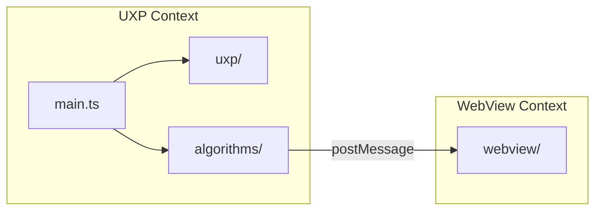

# Project Structure

Suggested directory layout for the Color Harmony Photoshop plugin, using Bolt UXP (Vite + React + TypeScript).

## Directory Tree

```
colors/
├── CLAUDE.md                     # AI assistant instructions
├── CONTRIBUTING.md               # Setup, dev workflow, PR process
├── docs/
│   ├── adr/                      # Architecture Decision Records
│   ├── analysis-*.md             # Research & analysis documents
│   └── project-structure.md      # This file
├── plugin/
│   ├── manifest.json             # UXP manifest v5 (source of truth)
│   ├── icons/                    # Plugin icons (23x23, 48x48 PNG)
│   └── index.html                # UXP entrypoint (loads bundle)
├── src/
│   ├── main.ts                   # UXP entrypoint, event listeners, panel lifecycle
│   ├── lib/
│   │   ├── logger.ts             # Logger abstraction (console now, Sentry later)
│   │   └── debounce.ts           # Generic debounce utility
│   ├── uxp/
│   │   ├── imaging.ts            # getPixels wrapper, executeAsModal, dispose
│   │   ├── events.ts             # PS event listener setup & management
│   │   └── bridge.ts             # postMessage bridge to WebView
│   ├── algorithms/
│   │   ├── color-extraction.ts   # MMCQ / K-Means dominant color extraction
│   │   ├── harmony.ts            # Harmony detection & scoring
│   │   ├── color-convert.ts      # RGB <-> HSL <-> HSV conversions
│   │   └── types.ts              # Shared types (Color, Harmony, Palette)
│   ├── webview/
│   │   ├── index.html            # WebView HTML entrypoint
│   │   ├── app.ts                # WebView main, message handler
│   │   ├── components/
│   │   │   ├── ColorWheel.ts     # SVG/Canvas color wheel renderer
│   │   │   ├── PaletteBar.ts     # Dominant color palette display
│   │   │   ├── HarmonyOverlay.ts # Harmony template overlay on wheel
│   │   │   └── ScoreLabel.ts     # Harmony match score/label
│   │   └── styles/
│   │       └── main.css          # WebView styles (dark theme matching PS)
│   └── __tests__/
│       ├── color-extraction.test.ts
│       ├── harmony.test.ts
│       └── color-convert.test.ts
├── uxp.config.ts                 # Bolt UXP config (manifest, hosts, panels)
├── vite.config.ts                # Vite config (dual build: UXP + WebView)
├── package.json
├── tsconfig.json
└── .gitignore
```

## Key Architectural Boundaries



### UXP Context (`src/main.ts`, `src/uxp/`, `src/algorithms/`)

- Runs in UXP runtime (not a browser)
- Has access to Photoshop APIs (`require("photoshop")`)
- Handles pixel acquisition, color extraction, harmony scoring
- No DOM rendering (besides minimal panel shell)

### WebView Context (`src/webview/`)

- Runs in embedded browser (Edge/Safari)
- Full HTML5 Canvas, SVG, CSS
- Receives processed data via `postMessage`
- Purely presentational — no PS API access

### Algorithms (`src/algorithms/`)

- Pure functions, no side effects, no PS dependencies
- Fully unit-testable in Node.js
- Could be extracted to a standalone library

## Build Output

Vite produces two bundles:

1. **UXP bundle** -> `plugin/index.js` (loaded by manifest.json)
2. **WebView bundle** -> `plugin/webview/index.html` + assets (loaded by WebView element)

## Naming Conventions

- Files: `kebab-case.ts`
- Types/Interfaces: `PascalCase`
- Functions: `camelCase`
- Constants: `UPPER_SNAKE_CASE`
- Test files: `*.test.ts` co-located in `__tests__/`
